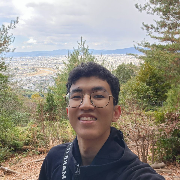
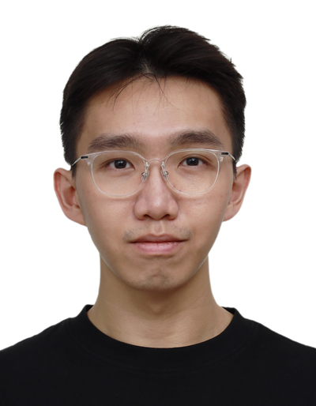
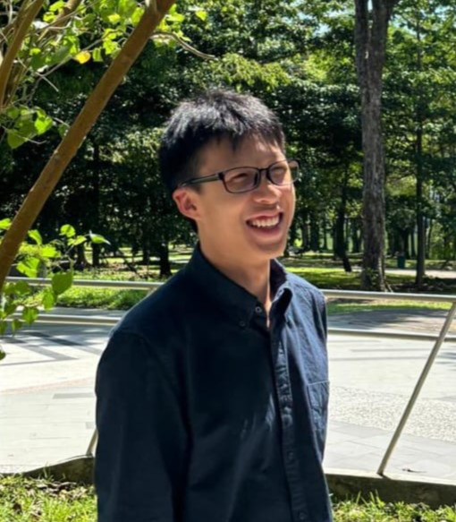
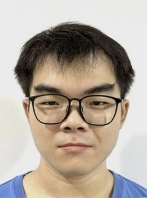

We are a team based in the [School of Computing, National University of Singapore](https://www.comp.nus.edu.sg).

You can reach us at the email `seer[at]comp.nus.edu.sg`

## Project team

### John Doe

[[github](https://github.com/shaneak03)]
[[portfolio](team/johndoe.md)]

* Role: Developer
* Responsibilities: Dev Ops

### Dylan Low

[[github](http://github.com/dlywlotus)]
[[portfolio](team/johndoe.md)]

* Role: Developer
* Responsibilities: Software development

### Hou Jin

[[github](http://github.com/203ZK/tp)] [[portfolio](team/houjin.md)]

* Role: Team Member
* Responsibilities: Attendance Marking

### Jean Doe

[[github](http://github.com/johndoe)]
[[portfolio](team/johndoe.md)]

* Role: Developer
* Responsibilities: Dev Ops + Threading

### Wong Jing Sin

[[github](http://github.com/wjingsin)]
[[portfolio](team/johndoe.md)]

* Role: Developer
* Responsibilities: UI
