* Table of Contents
{:toc}

--------------------------------------------------------------------------------------------------------------------

## **Acknowledgements**

* This project builds upon the AddressBook Level 3 (AB3) application and enhances it for teaching and class management needs.

--------------------------------------------------------------------------------------------------------------------

## **Setting up, getting started**

Refer to the guide [_Setting up and getting started_](SettingUp.md).

--------------------------------------------------------------------------------------------------------------------

## **Design**

:bulb: **Tip:** The `.puml` files used to create diagrams are in this document `docs/diagrams`
folder. Refer to the [_PlantUML
Tutorial_ at se-edu/guides](https://se-education.org/guides/tutorials/plantUml.html) to learn how to
create and edit diagrams.

### Architecture

The ***Architecture Diagram*** given above explains the high-level design of the App.

Given below is a quick overview of main components and how they interact with each other.

**Main components of the architecture**

**`Main`** (consisting of classes [
`Main`](https://github.com/AY2526S1-CS2103T-T12-2/tp/blob/master/src/main/java/seedu/tabs/Main.java)
and [
`MainApp`](https://github.com/AY2526S1-CS2103T-T12-2/tp/blob/master/src/main/java/seedu/tabs/MainApp.java))
is in charge of the app launch and shut down.

* At app launch, it initializes the other components in the correct sequence, and connects them up
  with each other.
* At shut down, it shuts down the other components and invokes cleanup methods where necessary.

The bulk of the app's work is done by the following four components:

* [**`UI`**](#ui-component): The UI of the App.
* [**`Logic`**](#logic-component): The command executor.
* [**`Model`**](#model-component): Holds the data of the App in memory.
* [**`Storage`**](#storage-component): Reads data from, and writes data to, the hard disk.

[**`Commons`**](#common-classes) represents a collection of classes used by multiple other
components.

**How the architecture components interact with each other**

The *Sequence Diagram* below shows how the components interact with each other for the scenario
where the user issues the command `delete_tutorial t/T1`.

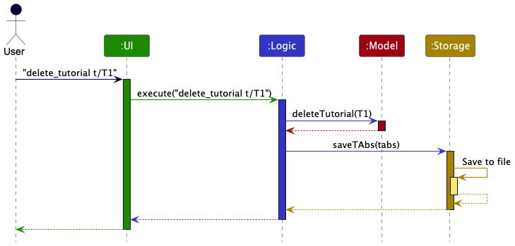

Each of the four main components (also shown in the diagram above),

* defines its *API* in an `interface` with the same name as the Component.
* implements its functionality using a concrete `{Component Name}Manager` class (which follows the
  corresponding API `interface` mentioned in the previous point.

For example, the `Logic` component defines its API in the `Logic.java` interface and implements its
functionality using the `LogicManager.java` class which follows the `Logic` interface. Other
components interact with a given component through its interface rather than the concrete class (
reason: to prevent outside component's being coupled to the implementation of a component), as
illustrated in the (partial) class diagram below.

The sections below give more details of each component.

### UI component

The **API** of this component is specified in [
`Ui.java`](https://github.com/AY2526S1-CS2103T-T12-2/tp/blob/master/src/main/java/seedu/tabs/ui/Ui.java)

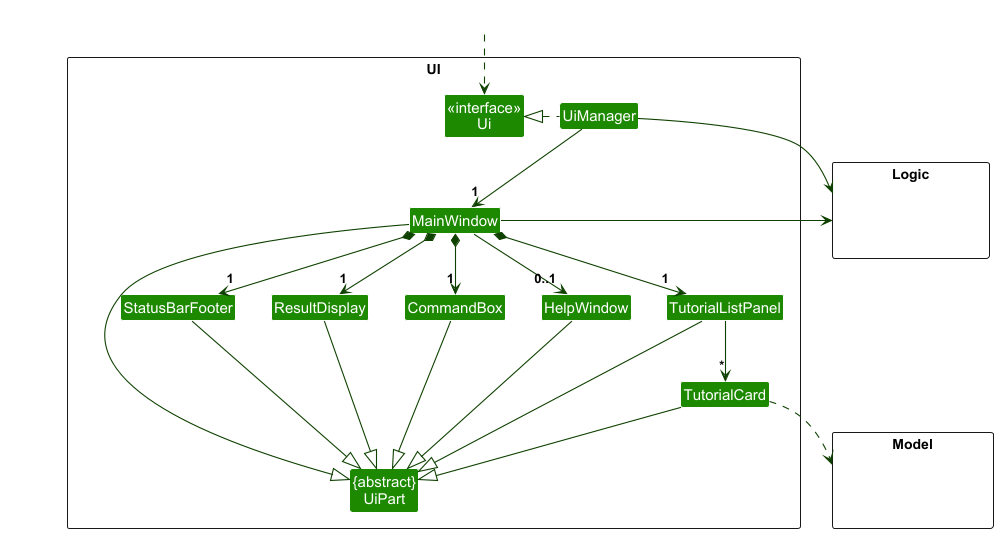

The UI consists of a `MainWindow` that is made up of parts e.g.`CommandBox`, `ResultDisplay`,
`TutorialListPanel`, `StatusBarFooter` etc. All these, including the `MainWindow`, inherit from the
abstract `UiPart` class which captures the commonalities between classes that represent parts of the
visible GUI.

The `UI` component uses the JavaFx UI framework. The layout of these UI parts are defined in
matching `.fxml` files that are in the `src/main/resources/view` folder. For example, the layout of
the [
`MainWindow`](https://github.com/AY2526S1-CS2103T-T12-2/tp/blob/master/src/main/java/seedu/tabs/ui/MainWindow.java)
is specified in [
`MainWindow.fxml`](https://github.com/AY2526S1-CS2103T-T12-2/tp/blob/master/src/main/resources/view/MainWindow.fxml)

The `UI` component,

* executes user commands using the `Logic` component.
* listens for changes to `Model` data so that the UI can be updated with the modified data.
* keeps a reference to the `Logic` component, because the `UI` relies on the `Logic` to execute
  commands.
* depends on some classes in the `Model` component, as it displays `Tutorial` object residing in the
  `Model`.

### Logic component

**API** : [
`Logic.java`](https://github.com/AY2526S1-CS2103T-T12-2/tp/blob/master/src/main/java/seedu/tabs/logic/Logic.java)

Here's a (partial) class diagram of the `Logic` component:

The sequence diagram below illustrates the interactions within the `Logic` component, taking
`execute("delete_tutorial t/T1")` API call as an example.

:information_source: **Note:** The lifeline for `DeleteTutorialCommandParser` should end at the destroy marker (X) but due to a limitation of PlantUML, the lifeline continues till the end of diagram.

How the `Logic` component works:

1. When `Logic` is called upon to execute a command, it is passed to a `TAbsParser` object
   which in turn creates a parser that matches the command (e.g., `DeleteTutorialCommandParser`) and uses it
   to parse the command.
1. This results in a `Command` object (more precisely, an object of one of its subclasses e.g.,
   `DeleteTutorialCommand`) which is executed by the `LogicManager`.
1. The command can communicate with the `Model` when it is executed (e.g. to delete a tutorial). 
   Note that although this is shown as a single step in the diagram above (for simplicity), in the
   code it can take several interactions (between the command object and the `Model`) to achieve.
1. The result of the command execution is encapsulated as a `CommandResult` object which is returned
   back from `Logic`.

Here are the other classes in `Logic` (omitted from the class diagram above) that are used for
parsing a user command:

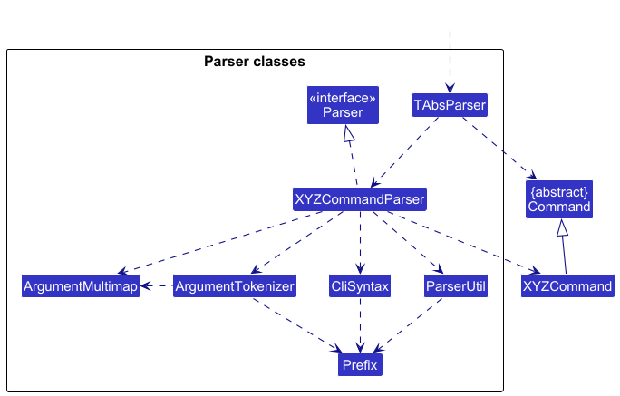

How the parsing works:

* When called upon to parse a user command, the `TAbsParser` class creates an
  `XYZCommandParser` (`XYZ` is a placeholder for the specific command name e.g., `AddTutorialCommandParser`)
  which uses the other classes shown above to parse the user command and create a `XYZCommand`
  object (e.g., `AddTutorialCommand`) which the `TAbsParser` returns back as a `Command` object.
* All `XYZCommandParser` classes (e.g., `AddTutorialCommandParser`, `DeleteTutorialCommandParser`, ...) inherit from
  the `Parser` interface so that they can be treated similarly where possible e.g, during testing.

### Model component

**API** : [
`Model.java`](https://github.com/AY2526S1-CS2103T-T12-2/tp/blob/master/src/main/java/seedu/tabs/model/Model.java)

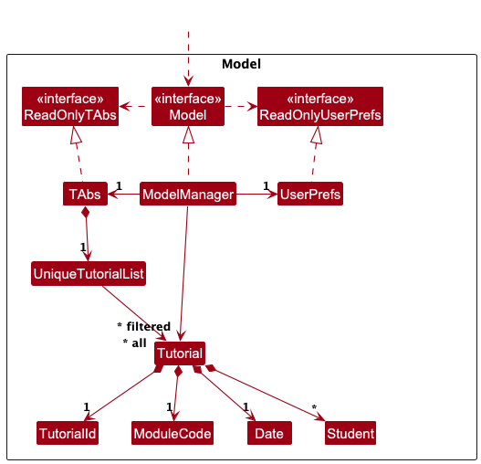

The `Model` component,

* stores the TAbs data i.e., all `Tutorial` objects (which are contained in a `UniqueTutorialList` object).
* stores the currently 'selected' `Tutorial` objects (e.g., results of a search query) as a separate _filtered_ list which is exposed to outsiders as an unmodifiable `ObservableList<Tutorial>` that can be 'observed' e.g. the UI can be bound to this list so that the UI automatically updates when the data in the list change.
* stores a `UserPref` object that represents the user’s preferences. This is exposed to the outside as a `ReadOnlyUserPref` objects.
* does not depend on any of the other three components (as the `Model` represents data entities of the domain, they should make sense on their own without depending on other components)

### Storage component

**API** : [
`Storage.java`](https://github.com/AY2526S1-CS2103T-T12-2/tp/blob/master/src/main/java/seedu/tabs/storage/Storage.java)

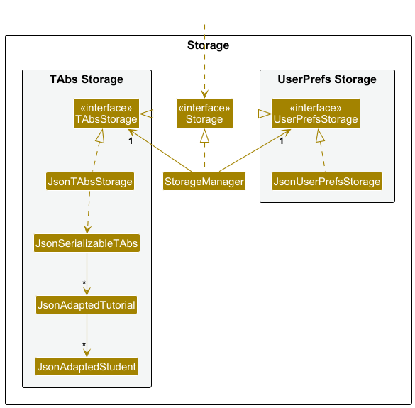

The `Storage` component,

* can save both TAbs data and user preference data in JSON format, and read them back into
  corresponding objects.
* inherits from both `TAbsStorage` and `UserPrefStorage`, which means it can be treated as either
  one (if only the functionality of only one is needed).
* depends on some classes in the `Model` component (because the `Storage` component's job is to
  save/retrieve objects that belong to the `Model`)

### Common classes

Classes used by multiple components are in the `seedu.tabs.commons` package.

--------------------------------------------------------------------------------------------------------------------

## **Implementation**

This section describes some noteworthy details on how certain features are implemented.

### \[Proposed\] Undo/redo feature

#### Proposed Implementation

The proposed undo/redo mechanism is facilitated by `VersionedTAbs`. It extends `TAbs`
with an undo/redo history, stored internally as an `tabsStateList` and `currentStatePointer`.
Additionally, it implements the following operations:

* `VersionedTAbs#commit()`— Saves the current TAbs state in its history.
* `VersionedTAbs#undo()`— Restores the previous TAbs state from its history.
* `VersionedTAbs#redo()`— Restores a previously undone TAbs state from its history.

These operations are exposed in the `Model` interface as `Model#commitTAbs()`,
`Model#undoTAbs()` and `Model#redoTAbs()` respectively.

Given below is an example usage scenario and how the undo/redo mechanism behaves at each step.

Step 1. The user launches the application for the first time. The `VersionedTAbs` will be
initialized with the initial TAbs state, and the `currentStatePointer` pointing to that
single TAbs state.

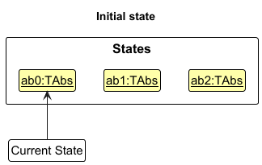

Step 2. The user executes `delete_tutorial t/T102` command to delete the specific tutorial in the TAbs. The
`delete_tutorial` command calls `Model#commitTAbs()`, causing the modified state of the TAbs
after the `delete_tutorial t/T102` command executes to be saved in the `tabsStateList`, and the
`currentStatePointer` is shifted to the newly inserted TAbs state.

Step 3. The user executes `add_tutorial t/T101 …​` to add a new tutorial. The `add_tutorial` command also calls
`Model#commitTAbs()`, causing another modified TAbs state to be saved into the
`tabsStateList`.

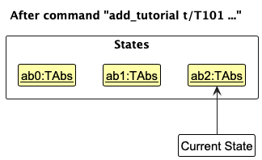

:information_source: **Note:** If a command fails its execution, it will not call `Model#commitTAbs()`, so the TAbs state will not be saved into the `tabsStateList`.

Step 4. The user now decides that adding the tutorial was a mistake, and decides to undo that action
by executing the `undo` command. The `undo` command will call `Model#undoTAbs()`, which will
shift the `currentStatePointer` once to the left, pointing it to the previous TAbs state, and
restores the TAbs to that state.

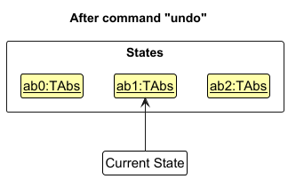

:information_source: **Note:** If the `currentStatePointer` is at index 0, pointing to the initial TAbs state, then there are no previous TAbs states to restore. The `undo` command uses `Model#canUndoTAbs()` to check if this is the case. If so, it will return an error to the user rather
than attempting to perform the undo.

The following sequence diagram shows how an undo operation goes through the `Logic` component:

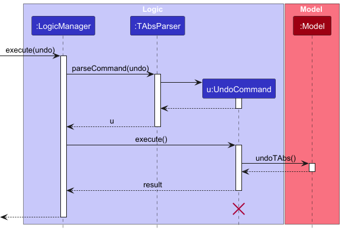

:information_source: **Note:** The lifeline for `UndoCommand` should end at the destroy marker (X) but due to a limitation of PlantUML, the lifeline reaches the end of diagram.

Similarly, how an undo operation goes through the `Model` component is shown below:

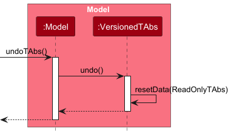

The `redo` command does the opposite — it calls `Model#redoTAbs()`, which shifts the
`currentStatePointer` once to the right, pointing to the previously undone state, and restores the
TAbs to that state.

:information_source: **Note:** If the `currentStatePointer` is at index `tabsStateList.size() - 1`, pointing to the latest TAbs state, then there are no undone TAbs states to restore. The `redo` command uses `Model#canRedoTAbs()` to check if this is the case. If so, it will return an error to the user rather than attempting to perform the redo.

Step 5. The user then decides to execute the command `list`. Commands that do not modify the
TAbs, such as `list`, will usually not call `Model#commitTAbs()`,
`Model#undoTAbs()` or `Model#redoTAbs()`. Thus, the `tabsStateList` remains unchanged.

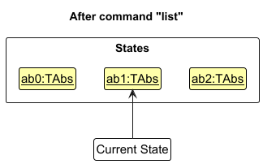

Step 6. The user executes `clear`, which calls `Model#commitTAbs()`. Since the
`currentStatePointer` is not pointing at the end of the `tabsStateList`, all TAbs states
after the `currentStatePointer` will be purged. Reason: It no longer makes sense to redo the
`add n/David …​` command. This is the behavior that most modern desktop applications follow.

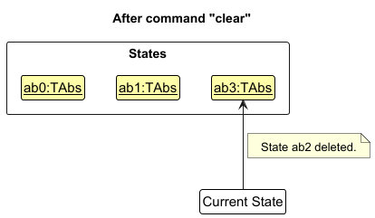

The following activity diagram summarizes what happens when a user executes a new command:

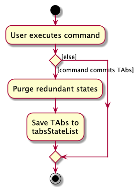

#### Design considerations:

**Aspect: How undo & redo executes:**

* **Alternative 1 (current choice):** Saves the entire of TAbs.
    * Pros: Easy to implement.
    * Cons: May have performance issues in terms of memory usage.

* **Alternative 2:** Individual command knows how to undo/redo by
  itself.
    * Pros: Will use less memory (e.g. for `delete`, just save the tutorial being deleted).
    * Cons: We must ensure that the implementation of each individual command are correct.

--------------------------------------------------------------------------------------------------------------------

## **Documentation, logging, testing, configuration, dev-ops**

* [Documentation guide](Documentation.md)
* [Testing guide](Testing.md)
* [Logging guide](Logging.md)
* [Configuration guide](Configuration.md)
* [DevOps guide](DevOps.md)

--------------------------------------------------------------------------------------------------------------------

## **Appendix: Requirements**

### Product scope

**Target user profile**:

TAbs is designed for School of Computing (SoC) Teaching Assistants (TAs) in the National University of Singapore (NUS) who need a reliable and structured way to manage tutorial sessions and student attendance.

These users typically:
* Conduct multiple tutorials or lab sessions across different modules.
* Manage a large number of students across classes.
* Prefer a desktop-based, offline-capable tool for privacy and reliability.
* Are comfortable typing commands in a CLI environment, but also appreciate a simple GUI for readability.
* Value efficiency, accuracy, and minimal administrative friction in tracking tutorial progress.

**Value proposition**:
TAbs provides a centralised system for SoC TAs to manage their classes, students, and attendance efficiently — all within a lightweight desktop app.
It automates repetitive administrative tasks like adding or copying tutorials, recording attendance, and viewing class lists.

By combining the speed of a command-line interface with the clarity of a graphical display, TAbs enables TAs to focus on teaching rather than manual record-keeping.
This results in smoother class preparation, faster attendance tracking, and better oversight of student engagement.

### User stories

Priorities: High (must have) - `* * *`, Medium (nice to have) - `* *`, Low (unlikely to have) - `*`

| Priority | As a … | I want to …                                                  | So that I can…                                                                                   |
|---------|--------|--------------------------------------------------------------|--------------------------------------------------------------------------------------------------|
| `***`   | TA     | add a tutorial class                                         | keep a record of my tutorials in one place                                                       |
| `***`   | TA     | delete a tutorial class                                      | remove outdated or cancelled tutorials                                                           |
| `***`   | TA     | view a list of all my tutorial classes                       | have an overview of my teaching schedule                                                         |
| `***`   | TA     | view all students in a specific tutorial                     | see my class roster at a glance                                                                  |
| `***`   | TA     | add a student to a specific tutorial                         | keep a record of students attending that tutorial                                                |
| `***`   | TA     | delete a student from a tutorial                             | remove students who have dropped the class                                                       |
| `***`   | TA     | mark a student’s attendance in a tutorial                    | track which students attended a particular session                                               |
| `***`   | TA     | unmark a student’s attendance                                | correct mistakes or update attendance records                                                    |
| `**`    | TA     | copy an existing tutorial with a new ID and date             | reuse student data for recurring tutorial sessions                                               |
| `**`    | TA     | edit a tutorial’s details                                    | update the module code, date, or tutorial ID without deleting the tutorial                       |
| `** `   | TA     | search for a tutorial based on Tutorial ID or Module Code    | quickly locate the tutorials I want without scrolling through the tutorial list                  |
| `**`    | TA     | mark all students in a tutorial as present                   | quickly record attendance for the entire class when everyone is present                          |
| `**`    | TA     | unmark all students in a tutorial                            | efficiently reset or correct attendance for the entire class in one command                      |
| `**`    | TA     | sort the tutorial list by date                               | view my upcoming tutorials in chronological order and plan my teaching schedule more easily      |
| `**`    | TA     | search for a student by name or ID                           | quickly locate a student’s record within large tutorials                                         |
| `**`    | TA     | tag students into groups                                     | organize my tutorial more efficiently for activities or grading                                  |
| `**`    | TA     | filter students by group tag                                 | view only students from a specific group                                                         |
| `**`    | TA     | view a summary of attendance for a tutorial                  | get an overview of participation and absences                                                    |
| `**`    | TA     | view a summary of a student’s participation across tutorials | identify students who may need follow-up                                                         |
| `**`    | New TA | view help messages or usage hints                            | learn how to use commands effectively                                                            |
| `**`    | New TA | see the correct format after entering an invalid command     | fix mistakes quickly and continue using the app                                                  |
| `*`     | TA     | find tutorials by date                                       | quickly locate tutorials happening on a specific day without manually scrolling through the list |
| `*`     | TA     | import a CSV file of student data                            | upload student lists easily from other sources                                                   |
| `*`     | TA     | export student lists or attendance records to a file         | keep offline records or share them with module coordinators                                      |
| `*`     | TA     | upload profile pictures of students                          | better associate student names with faces                                                        |
| `*`     | TA     | archive past tutorials                                       | keep my workspace tidy while retaining historical data                                           |

### Use cases

(For all use cases below, the **System** is the `TAbs` and the **Actor** is the `TA`, unless
specified otherwise)

**Use case: UC1 - Add a tutorial**

**MSS**

1. TA requests to add a new tutorial.
2. TAbs creates the tutorial.
3. TAbs confirms the creation of the tutorial.

   Use case ends.

**Extensions**

* 1a. Invalid or missing details are provided.
    * 1a1. TAbs informs the TA of the invalid input.

      Use case resumes from step 1.

* 2a. The tutorial already exists in the system.
    * 2a1. TAbs informs the TA that the tutorial already exists.

      Use case ends.

**Use case: UC2 - Delete a tutorial**

**MSS**

1. TA requests to delete a specific tutorial from the list.
2. TAbs deletes the tutorial.

   Use case ends.

**Extensions**

* 1a. There are no existing tutorials.
    * 1a1. TAbs displays that there are no tutorials to be deleted.

      Use case ends.

* 1b. TAbs detects that the tutorial does not exist.
    * 1b1. TAbs informs the TA that the tutorial does not exist.
    * 1b2. TAbs prompts the TA to delete another tutorial.

      Use case resumes from step 1.

**Use Case: UC3 - View all students in a tutorial**

**MSS**

1. TA requests to list all the students in a particular tutorial.
2. TAbs shows the list of students in the tutorial.

   Use case ends.

**Extensions**

* 1a. TAbs detects that the tutorial does not exist.
    * 1a1. TAbs informs the TA that the tutorial ID does not exist.

      Use case resumes from step 1.

* 1b. TAbs detects that the tutorial exists but has no students enrolled.
    * 1b1. TAbs prompts the TA that there are no students in the tutorial.

      Use case ends.

**Use case: UC4 - Add a student to a tutorial**

**MSS**

1. TA requests to add a student to a tutorial.
2. TAbs creates the new student entry in the specified tutorial.
3. TAbs confirms the addition of the student to the TA.

   Use case ends.

**Extensions**

* 1a. Invalid or missing details are provided.
    * 1a1. TAbs informs the TA of the invalid input.

      Use case resumes from step 1.

* 2a. The student already exists in the tutorial.
    * 2a1. TAbs informs the TA that the student is already in the tutorial.

      Use case ends.

**Use case: UC5 - Delete a student from a tutorial**

**MSS**

1. TA requests to delete a student from a tutorial.
2. TAbs removes the student from the specified tutorial.
3. TAbs confirms deletion of the student to the TA.
4. TAbs displays the updated list of students from the tutorial.

   Use case ends.

**Extensions**

* 1a. The student does not exist in the tutorial.
    * 1a1. TAbs informs the TA that the student does not exist in the tutorial.

      Use case ends resumes from step 1.

* 1b. Invalid or missing details are provided.
    * 1b1. TAbs informs the TA of the invalid input.

      Use case resumes from step 1.

**Use case: UC6 - Mark students in a tutorial as present**

**MSS**

1. TA requests to mark students in a tutorial.
2. TAbs marks the specified students, in the specified tutorial, as present.
3. TAbs displays the list of students who were marked.

   Use case ends.

**Extensions**

* 1a. One or more of the specified students do not exist in the tutorial.
    * 1a1. Those students are ignored and not marked.

      Use case resumes from step 2 for the remaining students.

* 1b. One or more of the specified students in the tutorial were already marked.
    * 1a1. Those students are ignored and not remarked.

      Use case resumes from step 2 for the remaining students.

* 1c. Invalid or missing details are provided.
    * 1b1. TAbs informs the TA of the invalid input.

      Use case resumes from step 1.

**Use case: UC7 - Unmark students in a tutorial**

**MSS**

1. TA requests to unmark the attendance of some students in a tutorial.
2. TAbs unmarks the specified students in the specified tutorial.
3. TAbs displays the list of students who were unmarked.

   Use case ends.

**Extensions**

* 1a. One or more of the specified students do not exist in the tutorial.
    * 1a1. Those students are ignored and not unmarked.

      Use case resumes from step 2 for the remaining students.

* 1b. One or more of the specified students in the tutorial were already unmarked.
    * 1a1. Those students are ignored and not unmarked.

      Use case resumes from step 2 for the remaining students.

* 1c. Invalid or missing details are provided.
    * 1b1. TAbs informs the TA of the invalid input.

      Use case resumes from step 1.

**Use Case: UC8 - Copy an existing tutorial with new ID and date**

**MSS**

1. TA requests to copy a tutorial.
2. TAbs creates a new tutorial by copying an existing tutorial (as specified by TA).
3. TAbs confirms the creation of the tutorial.
   Use case ends.

**Extension**

* 1a. Invalid or missing details are provided
    * 1a1.TAbs informs the TA of the invalid input.

      Use case resumes from step 1.
* 2a. TAbs detects that the tutorial ID that TA is trying to copy from does not exist.
    * 2a1. TAbs informs the TA that the tutorial ID does not exist

      Use case resumes from step 1.

**Use Case: UC9 - Edit a tutorial’s details**

**MSS**

1. TA requests to edit an existing tutorial’s details (e.g., ID, module code, or date).
2. TAbs updates the specified tutorial with the new details.
3. TAbs confirms that the tutorial has been successfully updated.
   Use case ends.

**Extension**

* 1a. Invalid or missing details are provided.
    * 1a1. TAbs informs the TA of the invalid input.

      Use case resumes from step 1.
* 1b. The tutorial specified by the TA does not exist.
    * 1a1. TAbs informs the TA that the tutorial ID does not exist.

      Use case resumes from step 1.
* 1c. The new tutorial ID entered already exists.
    * 2a1. TAbs informs the TA that the tutorial ID is already in use.

      Use case ends.

**Use case: UC10 - Find specific tutorials in TAbs**

**MSS**

1. TA requests to search for tutorials.
2. TAbs finds tutorials which match the given specifications.
3. TAbs displays the updated list of tutorials.
4. TAbs informs the TA of how many tutorials match the given specification
5. TAbs displays the updated filtered list of tutorials.

   Use case ends.

**Extensions**

* 1a. Invalid or missing details are provided.
    * 1a1. TAbs informs the TA of the invalid input.

      Use case resumes from step 1.

**Use case: UC11 - Mark all students' attendance in a tutorial**

**MSS**

1. TA requests to mark the attendance of every student in a tutorial.
2. TAbs confirms that every student in the tutorial has been marked as present.

   Use case ends.

**Extensions**

* 1a. There are no existing tutorials.
    * 1a1. TAbs displays that there are no tutorials available.

      Use case ends.

* 2a. TAbs detects that the tutorial has no students to be marked as present.
    * 2a1. TAbs informs the TA that the tutorial has no students to be marked as present.

      Use case ends.

**Use case: UC12 - Unmark all students' attendance in a tutorial**

**MSS**

1. TA requests to unmark the attendance of every student in a tutorial.
2. TAbs confirms that every student in the tutorial has been unmarked.

   Use case ends.

**Extensions**

* 1a. There are no existing tutorials.
    * 1a1. TAbs displays that there are no tutorials available.

      Use case ends.

* 2a. TAbs detects that the tutorial has no students to be unmarked.
    * 2a1. TAbs informs the TA that the tutorial has no students to be unmarked.

      Use case ends.

### Non-Functional Requirements

1. Local data manipulation commands (e.g., `add`, `delete`, `edit`, `mark`) must execute within **500ms** for a 
   database containing up to 5000 students and 100 tutorials. Verification should be conducted on a target environment 
   with a minimum of 8GB **RAM** and an **SSD** storage drive.
2. Handles up to 100 classes and 5000 students.
3. Runs on Windows, macOS, Linux with Java 17+.
4. A user demonstrating a typing speed of **40** WPM should be able to complete 80% of all defined 
   data manipulation tasks (e.g., `add`, `delete`, `edit`, `mark`) at least **20% faster** using the command line 
   interface than by using the equivalent mouse-based operation.
5. The application must automatically save all user changes to the local data file 
   after every successful command execution.

### Glossary

* **Mainstream OS**: Windows, Linux, Unix, MacOS
* **Matriculation number**: The unique identification number of each student (e.g., A1938293R)
* **Tutorial**: Each tutorial is part of a module, which is specified by a module code (e.g.,
  CS1231S)
  and a timeslot (e.g., Wednesdays 2pm to 4pm). Students can be marked as being present for each
  tutorial.

--------------------------------------------------------------------------------------------------------------------

## **Appendix: Instructions for manual testing**

Given below are instructions to test the app manually.

:information_source: **Note:** These instructions only provide a starting point for testers to work on;
testers are expected to do more *exploratory* testing.

### Launch and shutdown

1. Initial launch

    1. Download the `.jar` file and copy into an empty folder

    1. Double-click the `.jar` file Expected: Shows the GUI with a set of sample contacts. The window
       size may not be optimum.

1. Saving window preferences

    1. Resize the window to an optimum size. Move the window to a different location. Close the
       window.

    1. Re-launch the app by double-clicking the `.jar` file. 
       Expected: The most recent window size and location is retained.

1. _{ more test cases …​ }_

### Adding a tutorial

1. Adding a tutorial to TAbs

   1. Prerequisites: Have at least one existing tutorial in the list (can use `list` command to verify).

   2. Test case: `add_tutorial t/T1 m/CS2103T d/2025-11-15` 
      Expected: A new tutorial with ID `T1`, module code `CS2103T`, and date `2025-11-15` is added. Details of the added tutorial are shown in the status message. The tutorial list is displayed showing all tutorials.

   3. Test case: `add_tutorial t/T11 m/CS2103T d/2025-11-15 id/A1234567X` 
      Expected: A new tutorial with ID `T11` is added with one student (A1234567X). Details of the added tutorial are shown in the status message.

   4. Test case: `add_tutorial t/T12 m/CS2103T d/2025-11-15 id/A1234567X id/A7654321Y` 
      Expected: A new tutorial with ID `T12` is added with two students. Details of the added tutorial are shown in the status message.

   5. Test case: `add_tutorial t/T1 m/CS2103T d/2025-11-15` (where `T1` already exists) 
      Expected: No tutorial is added. Error message indicates that the tutorial already exists.

   6. Test case: `add_tutorial t/T13 m/CS2103T d/2025-13-15` (invalid date) 
      Expected: No tutorial is added. Error message indicates invalid date format.

   7. Test case: `add_tutorial t/T14 m/CS2103T` (missing required date) 
      Expected: No tutorial is added. Error message indicates invalid command format.

   8. Test case: `add_tutorial t/T15 m/CS2103T d/2025-11-15 m/CS2040` (duplicate prefix) 
      Expected: No tutorial is added. Error message indicates duplicate prefixes.

   9. Test case: `add_tutorial t/T16 m/CS2103T d/2025-01-01 from/T1` (extra prefix) 
      Expected: No tutorial is added. Error message indicates extra unexpected prefix

### Deleting a tutorial

1. Deleting a tutorial while all tutorials are being shown

    1. Prerequisites: List all tutorials using the `list` command. Multiple tutorials in the list.

    2. Test case: `delete_tutorial t/T1` 
       Expected: The tutorial with ID `T1` is deleted. Details of the deleted tutorial are shown in the
       status message.

    3. Test case: `delete_tutorial t/t1` 
       Expected: The tutorial with ID `T1` is still deleted due to case-insensitivity. Details of the deleted tutorial are shown in the
       status message.

    4. Test case: `delete_tutorial t/0` 
       Expected: No tutorial is deleted as the tutorial ID does not exist. Error details shown in the status message.

    5. Test case: `delete_tutorial m/0` 
       Expected: No tutorial is deleted as the prefix is incorrect. Error details shown in the status message.

    6. Test case: `delete_tutorial t/T1 t/T2` 
       Expected: No tutorial is deleted as there should only be one `t/` prefix. Error details shown in the status message.

2. Deleting a tutorial while only some tutorials are being shown.

    1. Prerequisites: List only some tutorials by using the `find t/1` command to display only tutorials with IDs containing `1`.

    2. Test cases are the same as above, and should produce the same results since the `delete_tutorial` command acts on the entire tutorial list in TAbs.

### Listing all the students in a tutorial

1. Listing all students while all tutorials are being shown

    1. Prerequisites: List all tutorials using the `list` command. Multiple tutorials in the list, and at least one tutorial (e.g., `T1`) has students enrolled.

    2. Test case: `list_students t/T1` 
       Expected: A numbered list of all student IDs in tutorial `T1` is displayed (e.g., `1. A1234567X`, `2. A7654321B`). The status message confirms that the students in `T1` are listed.

    3. Test case: `list_students t/t1` 
       Expected: Same result as above since tutorial IDs are case-insensitive. The same list of students from `T1` is displayed.

    4. Test case: `list_students t/T2` (where tutorial `T2` has no students) 
       Expected: An empty student list is displayed. The status message indicates that there are no students enrolled in tutorial `T2`.

    5. Test case: `list_students t/0` 
       Expected: No students are listed as the tutorial ID does not exist. Error details shown in the status message.

    6. Test case: `list_students m/CS2103T` 
       Expected: No students are listed as the prefix is incorrect. Error details shown in the status message.

    7. Test case: `list_students t/T1 t/T2` 
       Expected: No students are listed as there should only be one `t/` prefix. Error details shown in the status message.

2. Listing all students while only some tutorials are being shown.

    1. Prerequisites: List only some tutorials by using the `find t/1` command to display only tutorials with IDs containing `1`.

    2. Test cases are the same as above, and should produce the same results since the `list_students` command acts on the entire tutorial list in TAbs.
       After each command, the displayed list reverts to displaying all tutorials.

### Adding a student to a tutorial

1. Adding a new student to an existing tutorial
   
   1. Prerequisites: List all tutorials using the `list` command. 
   Tutorial `T01` exists and currently has no student with ID `A0000001Z`.

   2. Test case: `add_student id/A0000001Z t/T01` 
   Expected: Student `A0000001Z` is added to tutorial `T01`. 
   Confirmation message displays the details of the added student.

2. Adding multiple students, with some already in the tutorial

   1. Prerequisites: Tutorial `T01` exists and already contains student `A0000001Z`.
      Students `A0000002Z` and `A0000003Z` are not yet enrolled in the tutorial.
   
   2. Test case: `add_student id/A0000001Z id/A0000002Z id/A0000003Z t/T01` 
      Expected: Students `A0000002Z` and `A0000003Z` are successfully added to tutorial `T01`. Student `A0000001Z` is skipped as a duplicate. 
      Confirmation message indicates which students were successfully added, and which were duplicates

3. Attempting to add a student to a non-existent tutorial

    1. Prerequisites: Tutorial `T99` does not exist.

    2. Test case: `add_student id/A0000001Z t/T99`
       Expected: No student is added.
       Error message indicates that the tutorial `T99` does not exist.

4. Attempting to add a student to a non-existent tutorial

    1. Prerequisites: Tutorial `T99` does not exist.

    2. Test case: `add_student id/A0000001Z t/T99`
       Expected: No student is added.
       Error message indicates that the tutorial `T99` does not exist.

5. Missing or invalid prefixes

    1. Prerequisites: None.

    2. Test case: `add_student A0000001Z t/T01` 
       Expected: Invalid command usage error is thrown.

### Deleting a student from a tutorial

1. Deleting an existing student from a tutorial

    1. Prerequisites: List all tutorials using the `list` command.
       Tutorial `T01` exists and contains student `A0000001Z`.

    2. Test case: `delete_student id/A0000001Z t/T01`
       Expected: Student `A0000001Z` is deleted from tutorial `T01`.

2. Attempting to delete a student not in the tutorial

    1. Prerequisites: Tutorial `T01` exists, but student `A0000002Z` is not enrolled in it.

    2. Test case: `delete_student id/A0000002Z t/T01`
       Expected: Error saying the student is not in the tutorial is shown.

3. Attempting to delete a student from a non-existent tutorial

    1. Prerequisites: Tutorial `T99` does not exist. Student `A0000001Z` exists in another tutorial.

    2. Test case: `delete_student id/A0000001Z t/T99`
       Expected: Error saying the tutorial does not exist is shown.

4. Missing or invalid prefixes

    1. Prerequisites: None.

    2. Test case: `delete_student A0000001Z t/T01`
       Expected: Invalid command usage error is thrown.

### Marking students in a tutorial

1. Marking one or more valid students in an existing tutorial
    
    1. Prerequisites: List all tutorials using the `list` command. 
       Tutorial `T01` exists and contains student `A0000001Z` who is currently unmarked.

    2. Test case: `mark id/A0000001Z t/T01`
       Expected: Student `A0000001Z` becomes marked in tutorial `T01`.

2. Attempting to mark an already marked student

    1. Prerequisites: Tutorial `T01` exists and student `A0000001Z` is already marked.

    2. Test case: `mark id/A0000001Z t/T01`
       Expected: No student is marked. 
       An error message, saying Student `A0000001Z` is already marked, is shown.

3. Attempting to mark a non-existent student

    1. Prerequisites: Tutorial `T01` exists. Student `A9999999Z` does not exist.

    2. Test case: `mark id/A9999999Z t/T01`
       Expected: No student is marked. 
       An error message, saying Student `A0000001Z` does not exist, is shown. 
   
4. Attempting to mark in a non-existent tutorial

    1. Prerequisites: Tutorial `T99` does not exist.

    2. Test case: `mark id/A0000001Z t/T99`
       Expected: An error message, saying the tutorial does not exist is shown.

5. Missing or invalid prefixes

    1. Prerequisites: None
   
    2. Test case: `mark student/A0000001Z t/T01`
       Expected: An invalid command format error is shown. 

### Unmarking students in a tutorial

1. Unmarking one or more valid students in an existing tutorial

    1. Prerequisites: List all tutorials using the `list` command.
       Tutorial `T01` exists and contains student `A0000001Z` who is currently marked.

    2. Test case: `unmark id/A0000001Z t/T01`
       Expected: Student `A0000001Z` becomes unmarked in tutorial `T01`.

2. Attempting to unmark an already unmarked student

    1. Prerequisites: Tutorial `T01` exists and student `A0000001Z` is already unmarked.

    2. Test case: `unmark student/A0000001Z t/T01`
       Expected: No student is unmarked.
       An error message, saying Student `A0000001Z` is already unmarked, is shown.

3. Attempting to unmark a non-existent student

    1. Prerequisites: Tutorial `T01` exists. Student `A9999999Z` does not exist.

    2. Test case: `unmark id/A9999999Z t/T01`
       Expected: No student is unmarked.
       An error message, saying Student `A0000001Z` does not exist, is shown.

4. Attempting to unmark in a non-existent tutorial

    1. Prerequisites: Tutorial `T99` does not exist.

    2. Test case: `unmark id/A0000001Z t/T99`
       Expected: An error message, saying the tutorial does not exist is shown.

5. Missing or invalid prefixes

    1. Prerequisites: None

    2. Test case: `unmark id/A0000001Z t/T01`
       Expected: An invalid command format error is shown.

### Copying an existing tutorial

1. Copying a tutorial while all tutorials are being shown

    1. Prerequisites: List all tutorials using the `list` command. At least one tutorial (e.g., `T1`) exists in the list.

    2. Test case: `copy_tutorial t/T20 from/T1 d/2025-12-01` 
       Expected: A new tutorial with ID `T20` is created by copying from `T1` with the new date `2025-12-01`. All students from `T1` are copied to `T20`. Details of the copy operation are shown in the status message. The tutorial list is displayed showing all tutorials.

    3. Test case: `copy_tutorial t/T21 from/T1 d/2025-12-02` 
       Expected: Another copy is successfully created with ID `T21`.

    4. Test case: `copy_tutorial t/T1 from/T1 d/2025-12-03` (new ID same as source) 
       Expected: No tutorial is copied. Error message indicates that the tutorial ID already exists.

    5. Test case: `copy_tutorial t/T22 from/T99 d/2025-12-04` (source tutorial doesn't exist) 
       Expected: No tutorial is copied. Error message indicates that the source tutorial ID does not exist.

    6. Test case: `copy_tutorial t/T23 from/T1 d/2025-13-05` (invalid date) 
       Expected: No tutorial is copied. Error message indicates invalid date format.

    7. Test case: `copy_tutorial t/T24 from/T1` (missing required date) 
       Expected: No tutorial is copied. Error message indicates missing required prefix.

    8. Test case: `copy_tutorial t/T25 from/T1 d/2025-12-06 t/T26` (duplicate prefix) 
       Expected: No tutorial is copied. Error message indicates unexpected prefixes.

    9. Test case: `copy_tutorial t/T16 from/T1 d/2025-01-01 m/CS2103T` (extra prefix) 
       Expected: No tutorial is copied. Error message indicates extra unexpected prefix

2. Copying a tutorial while only some tutorials are being shown

    1. Prerequisites: List only some tutorials by using the `find t/1` command to display only tutorials with IDs containing `1`.

    2. Test cases are the same as above, and should produce the same results since the `copy_tutorial` command acts on the entire tutorial list in TAbs. After the command, the displayed list reverts to displaying all tutorials.

### Editing a tutorial

1. Editing a tutorial while all tutorials are being shown

   1. Prerequisites: List all tutorials using the `list` command. At least one tutorial (e.g., `T1`) exists in the list.

   2. Test case: `edit_tutorial from/T1 m/CS2101 d/2025-11-20` 
      Expected: The tutorial with ID `T1` is updated to have module code `CS2101` and date `2025-11-20`.
      Details of the updated tutorial are shown in the status message.

   3. Test case: `edit_tutorial from/T1 t/T2` 
      Expected: Tutorial `T1` is renamed to `T2`. The date and tutorial ID remain unchanged.

   4. Test case: `edit_tutorial from/T1 m/CS2103T` 
      Expected: Only the module code for tutorial `T1` is updated. The date and tutorial ID remain unchanged.

   5. Test case: `edit_tutorial from/T99 m/CS2103T d/2025-12-01` (nonexistent tutorial) 
      Expected: No tutorial is updated. Error message indicates that the specified tutorial ID does not exist.

   6. Test case: `edit_tutorial from/T1 m/CS2103T d/2025-13-01` (invalid date) 
      Expected: No tutorial is updated. Error message indicates invalid date format.

   7. Test case: `edit_tutorial from/T2 t/T1 m/CS2103` (duplicate prefix) 
      Expected: No tutorial is updated. Error message indicates specified tutorial ID already exists.
      
   8. Test case: `edit_tutorial t/T1 id/A1234567Z` (attempt to add student) 
      Expected: No tutorial is updated. Error message indicates that students should be managed via the student specific commands

2. Editing a tutorial while only some tutorials are being shown.

    1. Prerequisites: List only some tutorials by using the `find t/1` command to display only tutorials with IDs containing `1`.

    2. Test cases are the same as above, and should produce the same results since the `edit_tutorial` command acts on the entire tutorial list in TAbs.

### Finding tutorials by keyword

1. Finding tutorials while all tutorials are being shown

    1. Prerequisites: List all tutorials using the `list` command. Multiple tutorials exist with various tutorial IDs and module codes.

    2. Test case: `find t/T1` 
       Expected: Tutorials whose tutorial IDs contain `T1` (case-insensitive) are displayed. For example, `T1`, `T101`, and `t12` will all appear in the list.

    3. Test case: `find m/CS2103T` 
       Expected: Tutorials whose module code contains `CS2103T` (case-insensitive) are displayed. Partial matches such as `CS2103T-1` will also appear.

    4. Test case: `find t/T1 T2` 
       Expected: Tutorials whose tutorial ID contains `T1` or `T2` are displayed (OR search within same field).

    5. Test case: `find m/CS2103T CS2101` 
       Expected: Tutorials with module code containing either `CS2103T` or `CS2101` are displayed (OR search within same field).

    6. Test case: `find m/CS2103T t/T1` 
       Expected: Only tutorials that match both criteria are displayed — tutorials whose module code contains `CS2103T` and whose tutorial ID contains `T1`.

    7. Test case: `find m/CS2103T t/T1 T2` 
       Expected: Tutorials whose module code contains `CS2103T` and whose tutorial ID contains either `T1` or `T2` are displayed (AND between fields, OR within each field).

    8. Test case: `find t/` or `find m/` (empty keyword after prefix) 
       Expected: No tutorials are displayed. Error details shown in the status message.

    9. Test case: `find x/T1` 
       Expected: No tutorials are displayed as the prefix `x/` is invalid. Error details shown in the status message.

2. Finding tutorials while only some tutorials are being shown.

    1. Prerequisites: List only some tutorials by using the `find m/CS2103T` command to display tutorials under module `CS2103T`.

    2. Test cases are the same as above, and should produce the same results since the `find` command acts on the entire tutorial list in TAbs.
       After each command, the displayed list updates to show the tutorials matching the search criteria.

### Marking and unmarking all students in a tutorial

1. Marking/Unmarking all students in a tutorial while all tutorials are being shown

    1. Prerequisites: List all tutorials using the `list` command. Multiple tutorials in the list.

    2. Test case: `mark_all t/T1` or `unmark_all t/T1` (where tutorial with ID `T1` has students) 
       Expected: All students in the tutorial are marked as present (or unmarked). The students' tags should all turn green
       (or all turn to the default blue). Details of the students are shown in the status message.

    3. Test case: `mark_all t/T2` or `unmark_all t/T2` (where tutorial with ID `T2` has no students) 
       Expected: No change to the tutorial. THe status message states that there are no students to be marked/unmarked.

2. Marking/Unmarking all students in a tutorial while only some tutorials are being shown

    1. Prerequisites: List only some tutorials by using the `find t/1` command to display only tutorials with IDs containing `1`.

    2. Test cases are the same as above, and should produce the same results since the both commands act on the entire tutorial list in TAbs.
       After each command, the displayed list reverts to displaying all tutorials.

### Saving data

1. Dealing with missing/corrupted data files

   1. To simulate a missing file: delete the data file manually (`/data/tabs.json` or equivalent) and restart TAbs. 
   Expected: A new, empty data file is automatically created. No data from previous sessions is restored.

   2. To simulate a corrupted file: edit the data file manually and remove required brackets or fields. 
   Expected: TAbs detects invalid file format and resets storage. A new, empty data file is created with a warning message shown in the status area.

