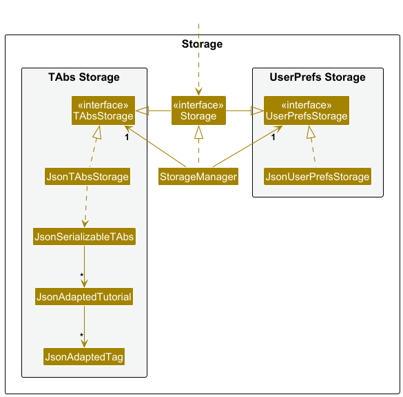
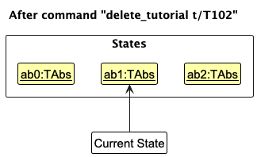

* Table of Contents
  {:toc}

--------------------------------------------------------------------------------------------------------------------

## **Acknowledgements**

* This project builds upon the AddressBook Level 3 (AB3) application and enhances it for teaching and class management needs.

--------------------------------------------------------------------------------------------------------------------

## **Setting up, getting started**

Refer to the guide [_Setting up and getting started_](SettingUp.md).

--------------------------------------------------------------------------------------------------------------------

## **Design**

:bulb: **Tip:** The `.puml` files used to create diagrams are in this document `docs/diagrams`
folder. Refer to the [_PlantUML
Tutorial_ at se-edu/guides](https://se-education.org/guides/tutorials/plantUml.html) to learn how to
create and edit diagrams.

### Architecture

The ***Architecture Diagram*** given above explains the high-level design of the App.

Given below is a quick overview of main components and how they interact with each other.

**Main components of the architecture**

**`Main`** (consisting of classes [
`Main`](https://github.com/AY2526S1-CS2103T-T12-2/tp/blob/master/src/main/java/seedu/tabs/Main.java)
and [
`MainApp`](https://github.com/AY2526S1-CS2103T-T12-2/tp/blob/master/src/main/java/seedu/tabs/MainApp.java))
is in charge of the app launch and shut down.

* At app launch, it initializes the other components in the correct sequence, and connects them up
  with each other.
* At shut down, it shuts down the other components and invokes cleanup methods where necessary.

The bulk of the app's work is done by the following four components:

* [**`UI`**](#ui-component): The UI of the App.
* [**`Logic`**](#logic-component): The command executor.
* [**`Model`**](#model-component): Holds the data of the App in memory.
* [**`Storage`**](#storage-component): Reads data from, and writes data to, the hard disk.

[**`Commons`**](#common-classes) represents a collection of classes used by multiple other
components.

**How the architecture components interact with each other**

The *Sequence Diagram* below shows how the components interact with each other for the scenario
where the user issues the command `delete_tutorial t/T1`.

Each of the four main components (also shown in the diagram above),

* defines its *API* in an `interface` with the same name as the Component.
* implements its functionality using a concrete `{Component Name}Manager` class (which follows the
  corresponding API `interface` mentioned in the previous point.

For example, the `Logic` component defines its API in the `Logic.java` interface and implements its
functionality using the `LogicManager.java` class which follows the `Logic` interface. Other
components interact with a given component through its interface rather than the concrete class (
reason: to prevent outside component's being coupled to the implementation of a component), as
illustrated in the (partial) class diagram below.

The sections below give more details of each component.

### UI component

The **API** of this component is specified in [
`Ui.java`](https://github.com/AY2526S1-CS2103T-T12-2/tp/blob/master/src/main/java/seedu/tabs/ui/Ui.java)

The UI consists of a `MainWindow` that is made up of parts e.g.`CommandBox`, `ResultDisplay`,
`TutorialListPanel`, `StatusBarFooter` etc. All these, including the `MainWindow`, inherit from the
abstract `UiPart` class which captures the commonalities between classes that represent parts of the
visible GUI.

The `UI` component uses the JavaFx UI framework. The layout of these UI parts are defined in
matching `.fxml` files that are in the `src/main/resources/view` folder. For example, the layout of
the [
`MainWindow`](https://github.com/AY2526S1-CS2103T-T12-2/tp/blob/master/src/main/java/seedu/tabs/ui/MainWindow.java)
is specified in [
`MainWindow.fxml`](https://github.com/AY2526S1-CS2103T-T12-2/tp/blob/master/src/main/resources/view/MainWindow.fxml)

The `UI` component,

* executes user commands using the `Logic` component.
* listens for changes to `Model` data so that the UI can be updated with the modified data.
* keeps a reference to the `Logic` component, because the `UI` relies on the `Logic` to execute
  commands.
* depends on some classes in the `Model` component, as it displays `Tutorial` object residing in the
  `Model`.

### Logic component

**API** : [
`Logic.java`](https://github.com/AY2526S1-CS2103T-T12-2/tp/blob/master/src/main/java/seedu/tabs/logic/Logic.java)

Here's a (partial) class diagram of the `Logic` component:

The sequence diagram below illustrates the interactions within the `Logic` component, taking
`execute("delete_tutorial t/T1")` API call as an example.

:information_source: **Note:** The lifeline for `DeleteTutorialCommandParser` should end at the destroy marker (X) but due to a limitation of PlantUML, the lifeline continues till the end of diagram.

How the `Logic` component works:

1. When `Logic` is called upon to execute a command, it is passed to a `TAbsParser` object
   which in turn creates a parser that matches the command (e.g., `DeleteTutorialCommandParser`) and uses it
   to parse the command.
1. This results in a `Command` object (more precisely, an object of one of its subclasses e.g.,
   `DeleteTutorialCommand`) which is executed by the `LogicManager`.
1. The command can communicate with the `Model` when it is executed (e.g. to delete a tutorial). 
   Note that although this is shown as a single step in the diagram above (for simplicity), in the
   code it can take several interactions (between the command object and the `Model`) to achieve.
1. The result of the command execution is encapsulated as a `CommandResult` object which is returned
   back from `Logic`.

Here are the other classes in `Logic` (omitted from the class diagram above) that are used for
parsing a user command:

How the parsing works:

* When called upon to parse a user command, the `TAbsParser` class creates an
  `XYZCommandParser` (`XYZ` is a placeholder for the specific command name e.g., `AddTutorialCommandParser`)
  which uses the other classes shown above to parse the user command and create a `XYZCommand`
  object (e.g., `AddTutorialCommand`) which the `TAbsParser` returns back as a `Command` object.
* All `XYZCommandParser` classes (e.g., `AddTutorialCommandParser`, `DeleteTutorialCommandParser`, ...) inherit from
  the `Parser` interface so that they can be treated similarly where possible e.g, during testing.

### Model component

**API** : [
`Model.java`](https://github.com/AY2526S1-CS2103T-T12-2/tp/blob/master/src/main/java/seedu/tabs/model/Model.java)

The `Model` component,

* stores the TAbs data i.e., all `Tutorial` objects (which are contained in a `UniqueTutorialList` object).
* stores the currently 'selected' `Tutorial` objects (e.g., results of a search query) as a separate _filtered_ list which is exposed to outsiders as an unmodifiable `ObservableList<Tutorial>` that can be 'observed' e.g. the UI can be bound to this list so that the UI automatically updates when the data in the list change.
* stores a `UserPref` object that represents the user’s preferences. This is exposed to the outside as a `ReadOnlyUserPref` objects.
* does not depend on any of the other three components (as the `Model` represents data entities of the domain, they should make sense on their own without depending on other components)

### Storage component

**API** : [
`Storage.java`](https://github.com/AY2526S1-CS2103T-T12-2/tp/blob/master/src/main/java/seedu/tabs/storage/Storage.java)

The `Storage` component,

* can save both TAbs data and user preference data in JSON format, and read them back into
  corresponding objects.
* inherits from both `TAbsStorage` and `UserPrefStorage`, which means it can be treated as either
  one (if only the functionality of only one is needed).
* depends on some classes in the `Model` component (because the `Storage` component's job is to
  save/retrieve objects that belong to the `Model`)

### Common classes

Classes used by multiple components are in the `seedu.tabs.commons` package.

--------------------------------------------------------------------------------------------------------------------

## **Implementation**

This section describes some noteworthy details on how certain features are implemented.

### \[Proposed\] Undo/redo feature

#### Proposed Implementation

The proposed undo/redo mechanism is facilitated by `VersionedTAbs`. It extends `TAbs`
with an undo/redo history, stored internally as an `tabsStateList` and `currentStatePointer`.
Additionally, it implements the following operations:

* `VersionedTAbs#commit()`— Saves the current addressbook state in its history.
* `VersionedTAbs#undo()`— Restores the previous addressbook state from its history.
* `VersionedTAbs#redo()`— Restores a previously undone addressbook state from its history.

These operations are exposed in the `Model` interface as `Model#commitaddressbook()`,
`Model#undoaddressbook()` and `Model#redoaddressbook()` respectively.

Given below is an example usage scenario and how the undo/redo mechanism behaves at each step.

Step 1. The user launches the application for the first time. The `VersionedTAbs` will be
initialized with the initial addressbook state, and the `currentStatePointer` pointing to that
single addressbook state.

Step 2. The user executes `delete 5` command to delete the 5th tutorial in the addressbook. The
`delete` command calls `Model#commitaddressbook()`, causing the modified state of the addressbook
after the `delete 5` command executes to be saved in the `tabsStateList`, and the
`currentStatePointer` is shifted to the newly inserted addressbook state.

Step 3. The user executes `add n/David …​` to add a new tutorial. The `add` command also calls
`Model#commitaddressbook()`, causing another modified addressbook state to be saved into the
`tabsStateList`.

:information_source: **Note:** If a command fails its execution, it will not call `Model#commitaddressbook()`, so the addressbook state will not be saved into the `tabsStateList`.

Step 4. The user now decides that adding the tutorial was a mistake, and decides to undo that action
by executing the `undo` command. The `undo` command will call `Model#undoaddressbook()`, which will
shift the `currentStatePointer` once to the left, pointing it to the previous addressbook state, and
restores the addressbook to that state.

:information_source: **Note:** If the `currentStatePointer` is at index 0, pointing to the initial addressbook state, then there are no previous addressbook states to restore. The `undo` command uses `Model#canUndoaddressbook()` to check if this is the case. If so, it will return an error to the user rather
than attempting to perform the undo.

The following sequence diagram shows how an undo operation goes through the `Logic` component:

:information_source: **Note:** The lifeline for `UndoCommand` should end at the destroy marker (X) but due to a limitation of PlantUML, the lifeline reaches the end of diagram.

Similarly, how an undo operation goes through the `Model` component is shown below:

The `redo` command does the opposite — it calls `Model#redoaddressbook()`, which shifts the
`currentStatePointer` once to the right, pointing to the previously undone state, and restores the
addressbook to that state.

:information_source: **Note:** If the `currentStatePointer` is at index `tabsStateList.size() - 1`, pointing to the latest addressbook state, then there are no undone addressbook states to restore. The `redo` command uses `Model#canRedoaddressbook()` to check if this is the case. If so, it will return an error to the user rather than attempting to perform the redo.

Step 5. The user then decides to execute the command `list`. Commands that do not modify the
addressbook, such as `list`, will usually not call `Model#commitaddressbook()`,
`Model#undoaddressbook()` or `Model#redoaddressbook()`. Thus, the `tabsStateList` remains unchanged.

Step 6. The user executes `clear`, which calls `Model#commitaddressbook()`. Since the
`currentStatePointer` is not pointing at the end of the `tabsStateList`, all addressbook states
after the `currentStatePointer` will be purged. Reason: It no longer makes sense to redo the
`add n/David …​` command. This is the behavior that most modern desktop applications follow.

The following activity diagram summarizes what happens when a user executes a new command:

#### Design considerations:

**Aspect: How undo & redo executes:**

* **Alternative 1 (current choice):** Saves the entire addressbook.
    * Pros: Easy to implement.
    * Cons: May have performance issues in terms of memory usage.

* **Alternative 2:** Individual command knows how to undo/redo by
  itself.
    * Pros: Will use less memory (e.g. for `delete`, just save the tutorial being deleted).
    * Cons: We must ensure that the implementation of each individual command are correct.

_{more aspects and alternatives to be added}_

### \[Proposed\] Data archiving

_{Explain here how the data archiving feature will be implemented}_

--------------------------------------------------------------------------------------------------------------------

## **Documentation, logging, testing, configuration, dev-ops**

* [Documentation guide](Documentation.md)
* [Testing guide](Testing.md)
* [Logging guide](Logging.md)
* [Configuration guide](Configuration.md)
* [DevOps guide](DevOps.md)

--------------------------------------------------------------------------------------------------------------------

## **Appendix: Requirements**

### Product scope

**Target user profile**:

* University student tutors who need to manage a large number of student contacts and related
  information.
* Prefer desktop apps over mobile or web alternatives
* Comfortable with typing and prefer keyboard input
* May not be technical, but are willing to learn simple systems
* Appreciate clear, straightforward tools that reduce the effort needed to manage information.

**Value proposition**: provide teaching assistants with a way to manage their
classes and their students within each class

### User stories

Priorities: High (must have) - `* * *`, Medium (nice to have) - `* *`, Low (unlikely to have) - `*`

| Priority | As a …  | I want to …                                                | So that I can…                                                                         |
|----------|---------|------------------------------------------------------------|----------------------------------------------------------------------------------------|
| `* * *`  | TA      | add a student to a class                                   | keep a record of students in my classes                                                |
| `* * *`  | TA      | delete a student from a class                              | remove students who are no longer in the class                                         |
| `* * *`  | TA      | view a list of students in a class                         | have an overview of my class roster                                                    |
| `* * *`  | TA      | add a class                                                | keep a record of my classes                                                            |
| `* * *`  | TA      | delete a class                                             | remove ununsed or obsolete classes.                                                    |
| `* * `   | TA      | add details for my classes                                 | add important details about the classes (e.g. module name, time)                       |
| `* * `   | TA      | mark a student’s participation                             | track engagement for tutorials and discussions                                         |
| `* * `   | TA      | unmark a student’s participation                           | undo marking a student’s participation in case of a mistake                            |
| `* * `   | TA      | edit a student’s details.                                  | fix data entry mistakes without re-creating a new student                              |
| `* * `   | TA      | edit a student’s details.                                  | fix data entry mistakes without re-creating a new student                              |
| `* * `   | TA      | find a tutorial based on Tutorial ID or Module Code        | quickly filter the list of tutorials to locate the specific tutorial I am looking for  |
| `* *`    | TA      | flag students who are underperforming                      | remember which students to follow up with                                              |
| `* *`    | TA      | tag students via groups                                    | organize students in a neat manner in the UI                                           |
| `* *`    | TA      | filter students by group tags                              | view only students from a specific group                                               |
| `* *`    | New TA  | view a help message                                        | see what commands I can use to navigate the app                                        |
| `* *`    | New TA  | see the correct format for commands after making a mistake | Use the commands correctly thereafter                                                  |
| `* *`    | Busy TA | see a summary of the overall data                          | quickly glean any urgent information I might need                                      |
| `* *`    | Busy TA | see a summary of the data for a student                    | quickly check the progress and status of a student                                     |
| `*`      | TA      | upload profile pictures of my students                     | identify students more easily and match their name to their face                       |
| `*`      | TA      | export student lists to a file                             | have an organised view of their progress (which is downloadable)                       |
| `*`      | TA      | import CSV to upload student data                          | easily upload student profiles                                                         |
| `*`      | TA      | archive past classes                                       | keep my current workspace clean while still retaining old records for future reference |

### Use cases

(For all use cases below, the **System** is the `TAbs` and the **Actor** is the `TA`, unless
specified otherwise)

**Use case: UC1 - Add a tutorial**

**MSS**

1. TA requests to add a new tutorial.
2. TAbs creates the tutorial.
3. TAbs confirms the creation of the tutorial.

   Use case ends.

**Extensions**

* 1a. Invalid or missing details are provided.
    * 1a1. TAbs informs the TA of the invalid input.

      Use case resumes from step 1.

* 2a. The tutorial already exists in the system.
    * 2a1. TAbs informs the TA that the tutorial already exists.

      Use case ends.

**Use case: UC2 - Delete a tutorial**

**MSS**

1. TA requests to delete a specific tutorial from the list.
2. TAbs deletes the tutorial.

   Use case ends.

**Extensions**

* 1a. There are no existing tutorials.
    * 1a1. TAbs displays that there are no tutorials to be deleted.

      Use case ends.

* 1b. TAbs detects that the tutorial does not exist.
    * 1b1. TAbs informs the TA that the tutorial does not exist.
    * 1b2. TAbs prompts the TA to delete another tutorial.

      Use case resumes from step 1.

**Use Case: UC3 - View all students in a tutorial**

**MSS**

1. TA requests to list all the students in a particular tutorial.
2. TAbs shows the list of students in the tutorial.

   Use case ends.

**Extensions**

* 1a. TAbs detects that the tutorial does not exist.
    * 1a1. TAbs informs the TA that the tutorial ID does not exist.
    * 1a2. TA prompts the TA to view students in another tutorial.

      Use case resumes from step 1.

* 1b. TAbs detects that the tutorial exists but has no students enrolled.
    * 1b1. TAbs prompts the TA that there are no students in the tutorial.

      Use case ends.

**Use case: UC4 - Add a student to a tutorial**

**MSS**

1. TA requests to add a student to a tutorial.
2. TAbs creates the new student entry in the specified tutorial.
3. TAbs confirms the addition of the student to the TA.

   Use case ends.

**Extensions**

* 1a. Invalid or missing details are provided.
    * 1a1. TAbs informs the TA of the invalid input.

      Use case resumes from step 1.

* 2a. The student already exists in the tutorial.
    * 2a1. TAbs informs the TA that the student is already in the tutorial.

      Use case ends.

**Use case: UC5 - Delete a student from a tutorial**

**MSS**

1. TA requests to delete a student from a tutorial.
2. TAbs removes the student from the specified tutorial.
3. TAbs confirms deletion of the student to the TA.
4. TAbs displays the updated list of students from the tutorial.

   Use case ends.

**Extensions**

* 1a. The student list for the tutorial is empty.
    * 1a1. TAbs informs the TA that there are no students to be deleted.

      Use case ends.

* 1b. Invalid or missing details are provided.
    * 1b1. TAbs informs the TA of the invalid input.

      Use case resumes from step 1.

**Use case: UC6 - Find specific tutorials in TAbs**

**MSS**

1. TA requests to search for tutorials.
2. TAbs finds tutorials which match the given specifications.
3. TAbs displays the updated list of tutorials.
4. TAbs informs the TA of how many tutorials match the given specification
5. TAbs displays the updated filtered list of tutorials.

   Use case ends.

**Extensions**

* 1a. Invalid or missing details are provided.
    * 1b1. TAbs informs the TA of the invalid input.

      Use case resumes from step 1.

### Non-Functional Requirements

1. Commands execute within 300ms (≤5000 students).
2. Handles up to 100 classes and 5000 students.
3. Runs on Windows, macOS, Linux with Java 17+.
4. A user with above average typing speed for regular English text (i.e. not code, not system admin
   commands) should be able to accomplish most of the tasks faster using commands than using the
   mouse.

### Glossary

* **Mainstream OS**: Windows, Linux, Unix, MacOS
* **Matriculation number**: The unique identification number of each student (e.g., A1938293R)
* **Tutorial**: Each tutorial is part of a module, which is specified by a module code (e.g.,
  CS1231S)
  and a timeslot (e.g., Wednesdays 2pm to 4pm). Students can be marked as being present for each
  tutorial.

--------------------------------------------------------------------------------------------------------------------

## **Appendix: Instructions for manual testing**

Given below are instructions to test the app manually.

:information_source: **Note:** These instructions only provide a starting point for testers to work on;
testers are expected to do more *exploratory* testing.

### Launch and shutdown

1. Initial launch

    1. Download the jar file and copy into an empty folder

    1. Double-click the jar file Expected: Shows the GUI with a set of sample contacts. The window
       size may not be optimum.

1. Saving window preferences

    1. Resize the window to an optimum size. Move the window to a different location. Close the
       window.

    1. Re-launch the app by double-clicking the jar file. 
       Expected: The most recent window size and location is retained.

1. _{ more test cases …​ }_

### Deleting a tutorial

1. Deleting a tutorial while all tutorials are being shown

    1. Prerequisites: List all tutorials using the `list` command. Multiple tutorials in the list.

    1. Test case: `delete 1` 
       Expected: First contact is deleted from the list. Details of the deleted contact shown in the
       status message. Timestamp in the status bar is updated.

    1. Test case: `delete 0` 
       Expected: No tutorial is deleted. Error details shown in the status message. Status bar
       remains the same.

    1. Other incorrect delete commands to try: `delete`, `delete x`, `...` (where x is larger than
       the list size) 
       Expected: Similar to previous.

1. _{ more test cases …​ }_

### Saving data

1. Dealing with missing/corrupted data files

    1. _{explain how to simulate a missing/corrupted file, and the expected behavior}_

1. _{ more test cases …​ }_
