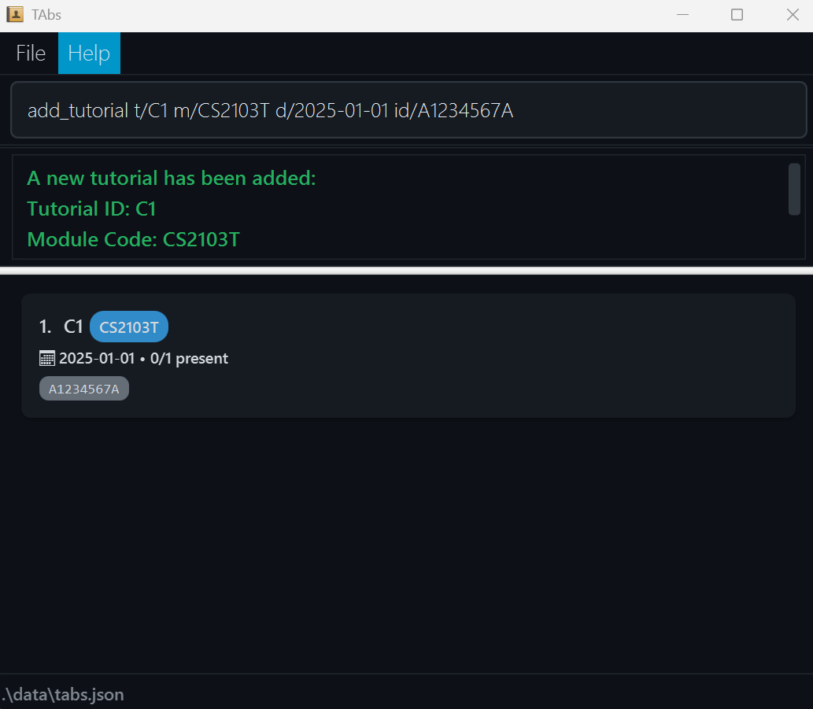
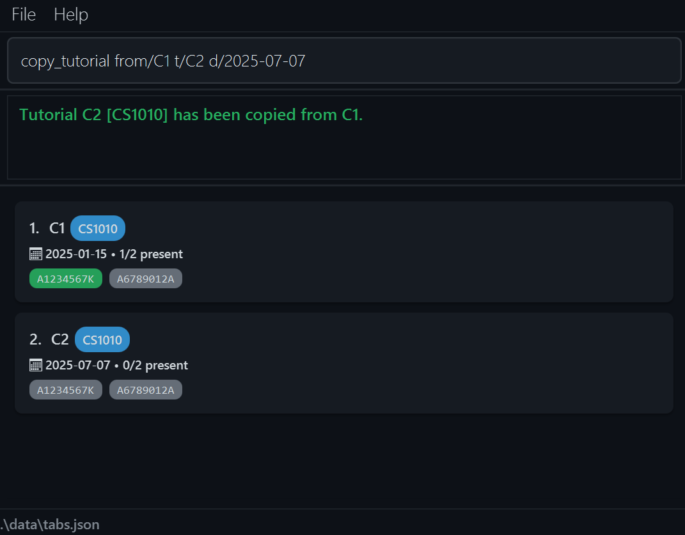
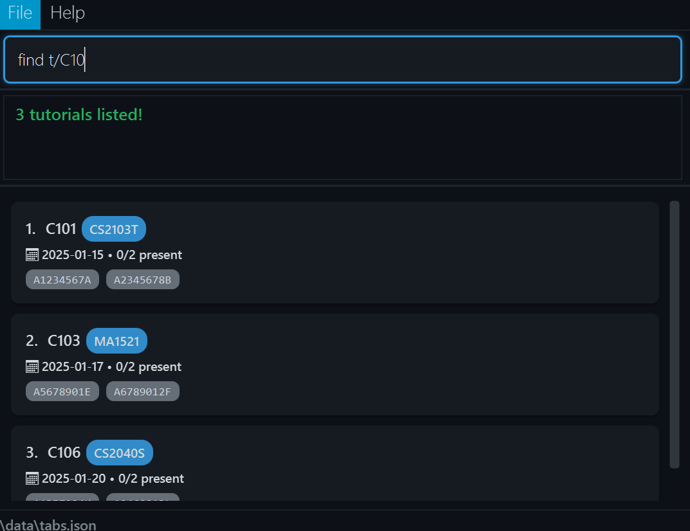
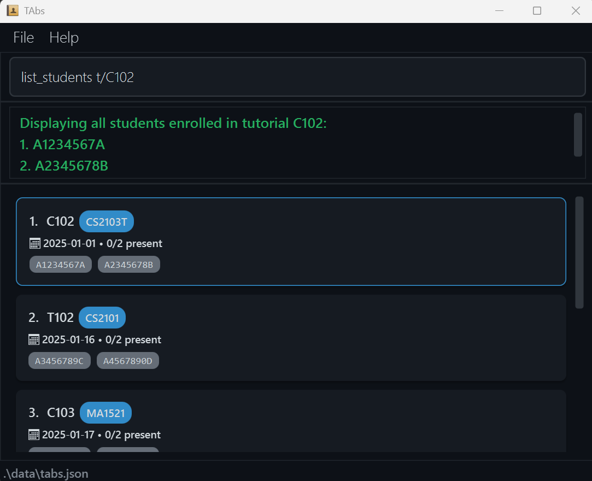
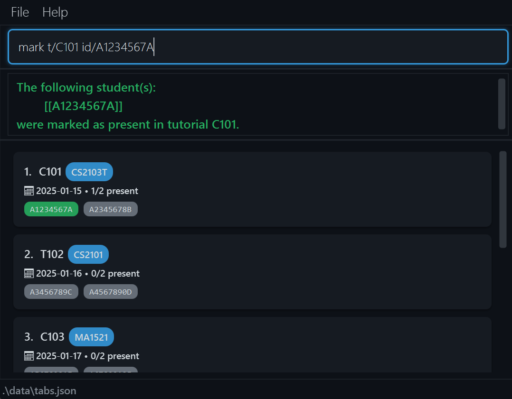

Are you an NUS Teaching Assistant (TA) in the School of Computing (SoC), struggling to keep track of your classes?
If you're looking for a centralised and user-friendly system to _keep TAbs on_ your TA duties, look no further: **TAbs** is here!
<br><br>
With so many students in so many tutorials, labs and recitations, it's easy to lose track of your students' attendance.
**TAbs** is a desktop app created just for you to manage your classes—while it's optimised for use via a Command Line Interface (CLI),
it still has the benefits of a Graphical User Interface (GUI).

* Table of Contents
{:toc}

--------------------------------------------------------------------------------------------------------------------

## Quick start

1. Ensure you have Java `17` or above installed in your computer.<br>
   **Mac users:** Ensure you have the precise JDK version
   prescribed [here](https://se-education.org/guides/tutorials/javaInstallationMac.html).

2. Download the latest `.jar` file
   from [here](https://github.com/AY2526S1-CS2103T-T12-2/tp/releases).

3. Copy the file to the folder you want to use as the _home folder_ for TAbs.

4. Open a command terminal, `cd` into the folder you put the `.jar` file in, and run the following command to start the application:
   ```
    java -jar TAbs.jar
   ```
   A GUI similar to the one below should appear in a few seconds. Note that the app may contain sample data.<br><br>
   <br><br>

5. Type your commands in the command box and press Enter to execute them, e.g., typing **`help`** and
   pressing Enter will open the help window.<br><br>
   Some example commands you can try:

    * `list`: Lists all tutorials.

    * `add_tutorial t/T123 m/CS2103T d/2025-01-01`: Adds a tutorial with ID `T123` for the module
      `CS2103T`.

    * `list_students t/T1`: Displays a list of all the students enrolled in the tutorial with ID
      `T1`.

    * `delete_tutorial t/T1`: Deletes the tutorial with ID `T1`.

    * `clear`: Deletes all tutorials.

    * `exit`: Exits the app.
   <br><br>

6. Refer to the [features](#features) below for details of each command.

--------------------------------------------------------------------------------------------------------------------

## Features

<div markdown="block" class="alert alert-info">

**:information_source: Notes about the command format:**<br>

* Words in `UPPER_CASE` are the parameters to be supplied by the user.<br>
  (e.g., in `add_tutorial t/TUTORIAL_ID`, `TUTORIAL_ID` is a parameter which can be used as
  `add_tutorial t/T123`.)

* Items in square brackets are optional.<br>
  (e.g., `t/TUTORIAL_ID [id/STUDENT]…` can be used as `t/T123 id/A1234567X` or as `t/T123`.)

* Items with `…` after them can be used multiple times, including zero times.<br>
  (e.g., `t/TUTORIAL_ID [id/STUDENT]…` can be used as `t/T123` (i.e., 0 times), `t/T123 id/A1234567X`,
  `t/T123 id/A1234567X id/A2234567Y`, etc.)

* Parameters can be in any order.<br>
  (e.g., if the command specifies `t/TUTORIAL_ID m/MODULE_CODE`, `m/MODULE_CODE t/TUTORIAL_ID` is also acceptable.)

* Extraneous parameters for commands that do not take in parameters (such as `help`, `list`, `exit`
  and `clear`) will be ignored.<br>
  (e.g., if the command specifies `help 123`, it will be interpreted as `help`.)

* If you are using a PDF version of this document, be careful when copying and pasting commands that
  span multiple lines as space characters surrounding line-breaks may be omitted when copied over to
  the application.

</div>

### Input Field Validation

TAbs validates all input fields to ensure data integrity. Below are the validation rules for each field type:

| Field Type | Prefix | Format Requirements | Valid Examples | Invalid Examples |
|------------|--------|---------------------|----------------|------------------|
| **Tutorial ID** | `t/` | - Single letter (case-insensitive)<br>- Followed by 1-8 digits<br>- **Automatically converted to uppercase** | `T1` or `t1`<br>`A123` or `a123`<br>`B12345678` or `b12345678` | `12T` (starts with digit)<br>`TT123` (two letters)<br>`T123456789` (too many digits) |
| **Module Code** | `m/` | - 2-4 letters (case-insensitive)<br>- Followed by 4 digits<br>- Optional letter at end (case-insensitive)<br>- **Automatically converted to uppercase** | `CS2103T` or `cs2103t`<br>`MA1521` or `ma1521`<br>`GESS1000` or `gess1000` | `CS210` (too few digits)<br>`COMPUTING2103` (too many letters)<br>`CS21033` (too many digits) |
| **Date** | `d/` | - Format: YYYY-MM-DD<br>- Must be valid calendar date<br>- Year must be between 1998 and 2200 | `2025-01-01`, `2024-12-31`, `2025-03-15` | `01-01-2025` (wrong order)<br>`2025/01/01` (wrong separator)<br>`2025-02-30` (invalid date)<br>`1997-01-01` (year too old)<br>`2201-01-01` (year too far ahead) |
| **Student ID** | `id/` | - Pattern: `AXXXXXXX&` (case-insensitive)<br>- First char: Letter 'A'<br>- Next 7 chars: Digits<br>- Last char: Any letter<br>- **Automatically converted to uppercase** | `A1234567X` or `a1234567x`<br>`A9876543B` or `a9876543b`<br>`A0123456C` or `a0123456c` | `B1234567X` (doesn't start with 'A')<br>`A123456X` (too few digits)<br>`A12345678X` (too many digits) |
| **Source Tutorial** | `from/` | - Same rules as Tutorial ID<br>- Used in `copy_tutorial` and `edit_tutorial`<br>- **Automatically converted to uppercase** | `T1` or `t1`<br>`C101` or `c101`<br>`A12345678` or `a12345678` | Same as Tutorial ID invalid examples |

<div markdown="span" class="alert alert-info">

**:information_source: Validation Tips:**<br>

* **All text fields are case-insensitive** and will be automatically converted to uppercase for consistency.
* TAbs will display specific error messages when validation fails, indicating which field has an issue and what format is expected.
* If multiple fields are invalid, TAbs will report the first invalid field encountered.
* All validation is performed before any changes are made to your data, ensuring data integrity.

</div>

### Viewing help: `help`

Shows a message explaining how to access the help page.


Format: `help`

### Listing all tutorials: `list`

Shows a list of all tutorials in TAbs.

Format: `list`

### Adding a tutorial: `add_tutorial`

Adds a tutorial to TAbs.

Format: `add_tutorial t/TUTORIAL_ID m/MODULE_CODE d/DATE [id/STUDENT_ID]…`

* Adds a tutorial with the specified tutorial ID, module code and date.
* Multiple students can be added to the same tutorial.
* If duplicate student IDs are specified in the same command, only unique students will be added (duplicates are automatically ignored).

Examples:

* `add_tutorial t/C456 m/CS2101 d/2025-01-01`
* `add_tutorial t/T123 m/CS2103T d/2025-01-01 id/A1231231Y id/A3213213Y`

After a tutorial has been added, the GUI will display the newly created tutorial card in the tutorial list as shown below. 
The card shows the tutorial's tutorial ID, module code, date, and the list of enrolled students (if any). 
All students in the new tutorial will initially be unmarked (displayed with their IDs in grey color).



### Deleting a tutorial: `delete_tutorial`

Deletes the specified tutorial from TAbs.

Format: `delete_tutorial t/TUTORIAL_ID`

* Deletes the tutorial with the specified `TUTORIAL_ID`.
* `TUTORIAL_ID` must already exist in TAbs.

Examples:

* `delete_tutorial t/T2` deletes the tutorial with ID `T2` in TAbs.

### Copying a tutorial: `copy_tutorial`

Creates a copy of an existing tutorial with a new tutorial ID and date.

Format: `copy_tutorial t/NEW_TUTORIAL_ID from/EXISTING_TUTORIAL_ID d/DATE`

* Copies an existing tutorial identified by the existing tutorial's ID and creates a new tutorial with a new ID and the specified date.
* `NEW_TUTORIAL_ID` must not already exist in TAbs.
* The `EXISTING_TUTORIAL_ID` must exist in TAbs.
* All students from the existing tutorial will be copied to the new tutorial with their attendance reset to being unmarked.
* The module code will be copied from the existing tutorial.

Examples:

* `copy_tutorial t/C2 from/C1 d/2025-04-10` copies the tutorial `C1` to create a new tutorial `C2` with
  the date `2025-04-10`.
* `copy_tutorial t/T202 from/T201 d/2025-05-15` copies the tutorial `T201` to create a new tutorial `T202`
  with the date `2025-05-15`.

Below is an example of the copy command being used.



### Editing a tutorial: `edit_tutorial`

Edits the details of an existing tutorial in TAbs.

Format: `edit_tutorial from/EXISTING_TUTORIAL_ID [t/NEW_TUTORIAL_ID] [m/NEW_MODULE_CODE] [d/NEW_DATE]`

* Updates the details of the tutorial identified by the tutorial ID specified after `from/`.
  * Attempting to edit a non-existent tutorial will result in an error: `Tutorial ID not found.`
* You may change **one or more** of the following:
    * Tutorial ID (`t/`)
    * Module code (`m/`)
    * Date (`d/`)
* At least one editable field (`t/`, `m/`, or `d/`) must be specified.
* Editing student lists (i.e., using `id/`) is **not allowed** here — use `add_student` or `delete_student` instead.

Examples:
* `edit_tutorial from/T123 t/T456` renames the tutorial with ID `T123` to `T456`.
* `edit_tutorial from/T456 m/CS2103T d/2025-10-25` updates the tutorial with ID `T456` to have module code `CS2103T` and date `2025-10-25`.
* `edit_tutorial from/T123 t/T789 m/CS2040S d/2025-08-20` updates the tutorial with ID `T123` to:
    * Have new ID `T789`
    * Change its module code to `CS2040S`
    * Set its new date to `2025-08-20`

### Finding tutorials by keyword: `find`

Finds tutorials whose tutorial ID and/or module code contain any of the given keywords.

Format: 
1. **Search by one field:** `find t/KEYWORD [MORE_KEYWORDS]…` or `find m/KEYWORD [MORE_KEYWORDS]…`
2. **Search by both fields (AND condition):** `find m/KEYWORD [MORE_KEYWORDS]… t/KEYWORD [MORE_KEYWORDS]…`

* You can search by tutorial ID (`t/`), module code (`m/`), or both.
* Within each field, tutorials matching **at least one keyword** will be returned (i.e., `OR` search).
* When searching by **both fields**, tutorials must match at least one keyword from **each field** (i.e., `AND` between fields, `OR` within each field).
* The search is case-insensitive (e.g., `t01` will match `T01`).
* Tutorial IDs or module codes which contain the keyword partially will also be matched (e.g., `CS2103` will match `CS2103T`).

Examples:

* `find m/CS2103T CS2101` returns tutorials with module code `CS2103T` OR `CS2101`
* `find t/A101 B202` returns tutorials with tutorial ID `A101` OR `B202`
* `find m/CS2103T t/A101` returns tutorials with module code `CS2103T` AND tutorial ID `A101`

  

### Listing all the students in a tutorial: `list_students`

Display a list of all the students enrolled in a specific tutorial on TAbs.

Format: `list_students t/TUTORIAL_ID`

* Lists all the students in a tutorial with the specified tutorial ID.
* It shows a numbered list of all the student IDs of the students in that tutorial (e.g., `1. A1234567X`).
`TUTORIAL_ID` must already exist in TAbs.

Examples:

* `list_students t/T2` lists all the students in the tutorial with ID `T2` in TAbs.

The list of students will be displayed in the output box as shown below.



### Adding students to a tutorial: `add_student`

Adds one or more students to a specified tutorial in TAbs.

Format: `add_student id/STUDENT_ID… t/TUTORIAL_ID`

* Adds one or more students, identified by their student IDs, to the tutorial identified by the tutorial ID.
* You can specify multiple student IDs in a single command, separated by spaces.
* `TUTORIAL_ID` must already exist in TAbs.


Examples:
* `add_student id/A1231231Y t/T1` adds a student `A1231231Y` to tutorial `T1`. 
* `add_student id/A1231231Y id/A3213213Y id/A2223334B t/T2` adds students `A1231231Y`, `A3213213Y` and `A2223334B` to tutorial `T2`.

---

Behaviour and duplicate handling:

* If all specified students already exist in the tutorial, TAbs will reject the command and show
  an error message:

  ```
  The following student(s):
    [[A1231231Y], [A3213213Y]]
  are already in tutorial T2!
  ```
* If some students already exist but others are new, TAbs will:

    * Add the new students successfully.
    * Notify the user that certain students were already in the tutorial.
      Example:

  ```
  The following student(s):
    [[A2223334B]]
  were added to tutorial T2.

  The following student(s):
    [[A1231231Y], [A3213213Y]]
  are already in tutorial T2!
  ```

---

### Deleting a student from a tutorial: `delete_student`

Deletes the specified student from the specified tutorial from TAbs.

Format: `delete_student id/STUDENT_ID t/TUTORIAL_ID`

* Delete a single student, identified by the student ID, from the tutorial identified by the tutorial ID.
* The `TUTORIAL_ID` must already exist in TAbs.

Examples:

* `delete_student id/A1231231Y t/T2` deletes the student with ID `A1231231Y` from the tutorial `T2`.

### Marking students in a tutorial as present: `mark`

Marks specified students in a tutorial in TAbs as present.

Format: `mark id/STUDENT_ID… t/TUTORIAL_ID`

* Marks one or more students, identified by their student ID, in the tutorial identified by the
  tutorial ID as present.
* You can specify multiple student IDs in a single command, separated by spaces.
* The `TUTORIAL_ID` must already exist in TAbs.

Examples:

* `mark id/A1231231Y t/C456` marks student `A1231231Y` in tutorial `C456` as present.
* `mark id/A1231231Y id/A3213213Y t/T123` marks students `A1231231Y` and `A3213213Y`
  in tutorial `T123` as present.

When a student has been marked as present, the GUI will update the student's ID within the tutorial to green as shown below.



Behaviour:

* After the mark command has been run, the students in the input will be categorised into 3 groups: 
  successfully marked, already marked, and not in the tutorial.
* If no students were successfully marked, TAbs will display the message as an error. 
* If at least one student was successfully marked, TAbs will display a success outcome.
* The following are messages that will be conditionally displayed based on whether any students
  fall in the respective groups.
   * Students who were successfully marked as present:
  ``` 
  The following student(s):
  [[A1231231Y], [A3213213Y]]
  were marked as present in tutorial T2.
  ```
    * Students who have already been marked:
  ``` 
  The following student(s):
  [[A1231231Y], [A3213213Y]]
  were already marked as present.
  ```  
    * Students who do not exist in the tutorial:
  ``` 
  The following student(s):
  [[A1231231Y], [A3213213Y]]
  are not in tutorial T2.
  ```  
* If there are no students in that particular group, the message for that group will not be shown.

### Marking ALL students in a tutorial as present: `mark_all`

Marks all students in a tutorial in TAbs as present.

Format: `mark_all t/TUTORIAL_ID`

* Marks all the students as present in the tutorial identified by the tutorial ID.
* The `TUTORIAL_ID` must already exist in TAbs.

Examples:

* `mark_all t/C456` marks every student in the tutorial with ID `C456` as present.


### Unmarking students in a tutorial: `unmark`

Unmarks specified students in a tutorial in TAbs.

Format: `unmark id/STUDENT_ID… t/TUTORIAL_ID`

* Unmarks one or more students, identified by their student ID, in the tutorial identified by the
  tutorial ID.
* You can specify multiple student IDs in a single command, separated by spaces.
* The `TUTORIAL_ID` must already exist in TAbs.

Examples:

* `unmark id/A1231231Y t/C456` unmarks student `A1231231Y` in tutorial `C456`.
* `unmark id/A1231231Y id/A3213213Y t/T123` unmarks student `A1231231Y` and student `A3213213Y`
  in tutorial `T123`.

Behaviour:
* The behaviour of unmark is similar to that of mark. Kindly refer to the behaviour section of the 
  mark command above.


### Unmarking ALL students in a tutorial: `unmark_all`

Unmarks all students in a tutorial in TAbs.

Format: `unmark_all t/TUTORIAL_ID`

* Unmarks all the students in the tutorial identified by the tutorial ID.
* The `TUTORIAL_ID` must already exist in TAbs.

Examples:

* `unmark_all t/C456` unmarks every student in the tutorial with ID `C456`.


### Clearing all tutorials: `clear`

Removes all tutorials from TAbs.

Format: `clear`

### Exiting the program: `exit`

Exits the TAbs application.

Format: `exit`

### Saving the data

TAbs data are saved in the hard disk automatically after any command that changes the data. There is
no need to save manually.

### Editing the data file

TAbs data are saved automatically as a JSON file `[JAR file location]/data/TAbs.json`. Advanced
users are welcome to update data directly by editing that data file.

<div markdown="span" class="alert alert-warning">:exclamation: **Caution:**
    If your changes to the data file makes its format invalid, TAbs will discard all data and start with an empty data file at the next run. Hence, it is recommended to take a backup of the file before editing it.<br>
    Furthermore, certain edits can cause TAbs to behave in unexpected ways (e.g., if a value entered is beyond the acceptable range). Therefore, edit the data file only if you are confident that you can update it correctly.
</div>

### Future plans `[coming in v2.0]`

We intend to release an even more user-friendly version to the wider NUS community, 
featuring a proper user interface without the need of a CLI.

--------------------------------------------------------------------------------------------------------------------

## FAQ

**Q**: How do I transfer my data to another computer?<br>
**A**: Install the app on the other computer and run it once to generate the initial data file. 
Close the app, then overwrite the `TAbs.json` file it creates (which contains sample data) with the 
`TAbs.json` file that contains your data from your previous TAbs home folder. The file can be found at 
`[JAR file location]/data/TAbs.json`. After replacing the file, run the app again to use your transferred data.

--------------------------------------------------------------------------------------------------------------------

## Known issues

1. **When using multiple screens**, if you move the application to a secondary screen, and later
   switch to using only the primary screen, the GUI will open off-screen. The remedy is to delete
   the `preferences.json` file created by the application before running the application again.
2. **If you minimize the Help Window** and then run the `help` command (or use the `Help` menu, or
   the keyboard shortcut `F1`) again, the original Help Window will remain minimized, and no new
   Help Window will appear. The remedy is to manually restore the minimized Help Window.

--------------------------------------------------------------------------------------------------------------------

## Command summary

| Action                          | Format, Examples                                                                                                                                          |
|---------------------------------|-----------------------------------------------------------------------------------------------------------------------------------------------------------|
| **Help**                        | `help`                                                                                                                                                    |
| **List tutorials**              | `list`                                                                                                                                                    |
| **Add a tutorial**              | `add_tutorial t/TUTORIAL_ID m/MODULE_CODE d/DATE [id/STUDENT_ID]…` <br> (e.g., `add_tutorial t/T123 m/CS2103T d/2025-01-01 id/A1231231Y`)                 |
| **Delete a tutorial**           | `delete_tutorial t/TUTORIAL_ID`<br> (e.g., `delete_tutorial t/T1`)                                                                                        |
| **Copy a tutorial**             | `copy_tutorial t/NEW_TUTORIAL_ID from/EXISTING_TUTORIAL_ID d/DATE` <br> (e.g., `copy_tutorial t/C2 from/C1 d/2025-04-10`)                                 |
| **Edit a tutorial**             | `edit_tutorial from/EXISTING_TUTORIAL_ID [t/NEW_TUTORIAL_ID] [m/NEW_MODULE_CODE] [d/NEW_DATE]`<br> (e.g., `edit_tutorial from/T1 m/CS2103T d/2025-10-25`) |
| **Find tutorials**              | `find m/KEYWORD… t/KEYWORD…` (either or both fields)<br> (e.g., `find m/CS2103T`, `find t/A101`, `find m/CS2103T t/A101`)                                 |
| **List students in a tutorial** | `list_students t/TUTORIAL_ID`<br> (e.g., `list_students t/T1`)                                                                                            |
| **Add student(s)**              | `add_student id/STUDENT_ID… t/TUTORIAL_ID` <br> (e.g., `add_student id/A1231231Y id/A3213213Y t/T2`)                                                      |
| **Delete a student**            | `delete_student id/STUDENT_ID t/TUTORIAL_ID` <br> (e.g., `delete_student id/A3213213Y t/T123`)                                                            |
| **Mark a student**              | `mark id/STUDENT_ID… t/TUTORIAL_ID` <br> (e.g., `mark id/A1231231Y id/A3213213Y t/T123`)                                                                  |
| **Mark all students**           | `mark_all t/TUTORIAL_ID` <br> (e.g., `mark_all t/T123`)                                                                                                   |
| **Unmark a student**            | `unmark id/STUDENT_ID… t/TUTORIAL_ID` <br> (e.g., `unmark id/A1231231Y id/A3213213Y t/T123`)                                                              |
| **Unmark all students**         | `unmark_all t/TUTORIAL_ID` <br> (e.g., `unmark_all t/T123`)                                                                                               |
| **Clear all tutorials**         | `clear`                                                                                                                                                   |
| **Exit TAbs**                   | `exit`                                                                                                                                                    |
