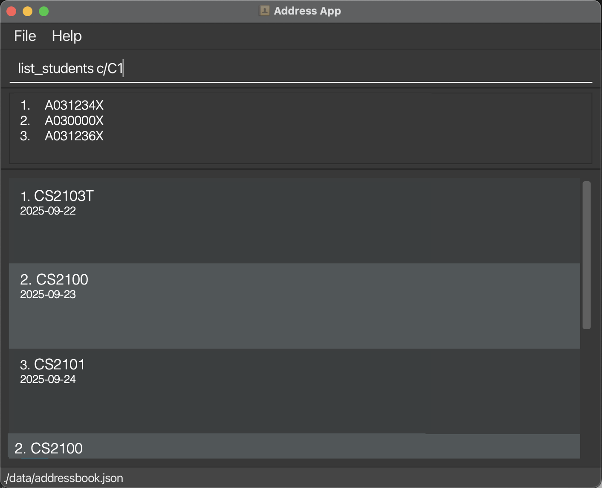
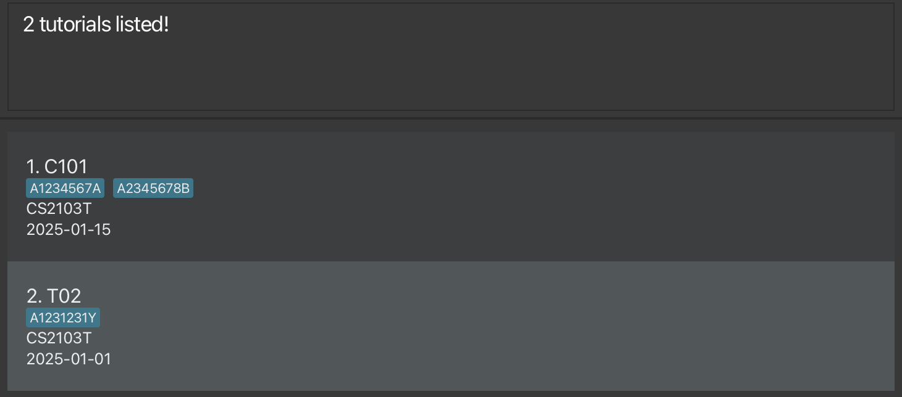

TAbs is a **desktop app for managing contacts, optimized for use via a Command Line Interface** (
CLI) while still having the benefits of a Graphical User Interface (GUI).
If you can type fast, TAbs can get your class management tasks done faster than traditional GUI
apps.

* Table of Contents
  {:toc}

--------------------------------------------------------------------------------------------------------------------

## Quick start

1. Ensure you have Java `17` or above installed in your Computer.<br>
   **Mac users:** Ensure you have the precise JDK version
   prescribed [here](https://se-education.org/guides/tutorials/javaInstallationMac.html).

2. Download the latest `.jar` file
   from [here](https://github.com/se-edu/addressbook-level3/releases).

3. Copy the file to the folder you want to use as the _home folder_ for your TAbs.

4. Open a command terminal, `cd` into the folder you put the jar file in, and use the
   `java -jar TAbs.jar` command to run the application.<br>
   A GUI similar to the below should appear in a few seconds. Note how the app contains some sample
   data.<br>
   

5. Type the command in the command box and press Enter to execute it. e.g. typing **`help`** and
   pressing Enter will open the help window.<br>
   Some example commands you can try:

    * `list` : Lists all tutorials.

    * `add_tutorial t/T123 m/CS2103T d/2025-01-01` : Adds a tutorial with ID `T123` for module
      CS2103T.

    * `list_students t/T1` : Display a list of all the students enrolled in the tutorial with ID
      `T1`.

    * `delete_tutorial t/T1` : Deletes the tutorial with ID `T1`.

    * `clear` : Deletes all tutorials.

    * `exit` : Exits the app.

6. Refer to the [Features](#features) below for details of each command.

--------------------------------------------------------------------------------------------------------------------

## Features

<div markdown="block" class="alert alert-info">

**:information_source: Notes about the command format:**<br>

* Words in `UPPER_CASE` are the parameters to be supplied by the user.<br>
  e.g. in `add_tutorial t/TUTORIAL_ID`, `TUTORIAL_ID` is a parameter which can be used as
  `add_tutorial t/T123`.

* Items in square brackets are optional.<br>
  e.g. `t/TUTORIAL_ID [id/STUDENT]…​` can be used as `t/T123 id/A1234567X` or as `t/T123`.

* Items with `…`​ after them can be used multiple times including zero times.<br>
  e.g. `[id/STUDENT]…​` can be used as ` ` (i.e. 0 times), `id/A1234567X`,
  `id/A1234567X id/A2234567Y` etc.

* Parameters can be in any order.<br>
  e.g. if the command specifies `t/TUTORIAL_ID m/MODULE_CODE`, `m/MODULE_CODE t/TUTORIAL_ID` is also acceptable.

* Extraneous parameters for commands that do not take in parameters (such as `help`, `list`, `exit`
  and `clear`) will be ignored.<br>
  e.g. if the command specifies `help 123`, it will be interpreted as `help`.

* If you are using a PDF version of this document, be careful when copying and pasting commands that
  span multiple lines as space characters surrounding line-breaks may be omitted when copied over to
  the application.

</div>

### Viewing help: `help`

Shows a message explaining how to access the help page.


Format: `help`

### Listing all tutorials: `list`

Shows a list of all tutorials in TAbs.

Format: `list`

### Adding a tutorial: `add_tutorial`

Adds a tutorial to TAbs.

Format: `add_tutorial t/TUTORIAL_ID m/MODULE_CODE d/DATE [id/STUDENT] …​`

* Adds a tutorial with the specified `TUTORIAL_ID`, `MODULE_CODE`, and `DATE`.
* The tutorial ID must match the format `(C|T)` followed by digits (e.g., T1, C123).
* The module code should follow standard university module code format (e.g., CS2103T).
* The date should be in YYYY-MM-DD format.
* Students can be added optionally using their student IDs (format: A followed by 7 digits and a
  capital letter).
* Multiple students can be added to the same tutorial.

Examples:

* `add_tutorial t/C456 m/CS2101 d/2025-01-01`
* `add_tutorial t/T123 m/CS2103T d/2025-01-01 id/A1231231Y id/A3213213Y`

### Deleting a tutorial: `delete_tutorial`

Deletes the specified tutorial from TAbs.

Format: `delete_tutorial t/TUTORIAL_ID`

* Deletes the tutorial with the specified `TUTORIAL_ID`.
* The tutorial ID refers to the title of the tutorial as displayed in TAbs.
* The input must match the tutorial's ID exactly (case-sensitive).

Examples:

* `delete_tutorial t/T2` deletes the tutorial with ID `T2` in **TAbs**.

### Copying a tutorial: `copy_tutorial`

Creates a copy of an existing tutorial with a new tutorial ID and date.

Format: `copy_tutorial t/NEW_TUTORIAL_ID from/EXISTING_TUTORIAL_ID d/DATE`

* Copies an existing tutorial identified by `EXISTING_TUTORIAL_ID` and creates a new tutorial with
  `NEW_TUTORIAL_ID` and the specified `DATE`.
* The new tutorial ID must match the format `(C|T)` followed by digits (e.g., T1, C123).
* The new tutorial ID must not already exist in TAbs.
* The existing tutorial ID must exist in TAbs.
* All students from the existing tutorial will be copied to the new tutorial.
* The module code will be copied from the existing tutorial.
* The date should be in YYYY-MM-DD format.

Examples:

* `copy_tutorial t/C2 from/C1 d/2025-04-10` - Copies tutorial C1 to create a new tutorial C2 with
  date 2025-04-10.
* `copy_tutorial t/T202 from/T201 d/2025-05-15` - Copies tutorial T201 to create a new tutorial T202
  with date 2025-05-15.

### Editing a tutorial: `edit_tutorial`
Edits the details of an existing tutorial in **TAbs**.

Format: `edit_tutorial from/EXISTING_TUTORIAL_ID [t/NEW_TUTORIAL_ID] [m/NEW_MODULE_CODE] [d/NEW_DATE]`

* Updates the details of the tutorial identified by the tutorial ID specified after `from/`.
* You may change **one or more** of the following:
    * Tutorial ID (`t/`)
    * Module code (`m/`)
    * Date (`d/`)
* The tutorial ID provided with `from/` must exactly match an existing tutorial (case-sensitive).
* At least one editable field (`t/`, `m/`, or `d/`) must be specified.
* Editing student lists (e.g. using `id/`) is **not allowed** here — use `add_student` or `delete_student` instead.

Examples:
* `edit_tutorial from/T123 t/T456` - Renames tutorial `T123` to `T456`.
* `edit_tutorial from/T456 m/CS2103T d/2025-10-25` - Updates tutorial `T456` to have module code `CS2103T` and date `2025-10-25`.
* `edit_tutorial from/T123 t/T789 m/CS2040S d/2025-08-20` - Updates the tutorial with ID `T123` to:
    * Have new ID `T789`
    * Change its module code to `CS2040S`
    * Set its new date to `2025-08-20`

Common Errors:
* The `from/` prefix is **mandatory**, as it tells TAbs which tutorial to edit.
* Attempting to edit a non-existent tutorial will result in an error:`Tutorial ID not found.`
* If no editable fields are provided: `At least one field to edit must be provided.`
* If a student field (e.g. `id/`) is accidentally included:
  `Students cannot be edited via this command. Please use the add_student or delete_student commands instead.`

### Finding tutorials by name: `find`

Finds tutorials whose `MODULE_CODE` or `TUTORIAL_ID` contain any of the given keywords.

Format: `find KEYWORD [MORE_KEYWORDS]`

* The search is case-sensitive, e.g. `t01` will not match `T01`.
* Only full words will be matched, e.g. `CS2103` will not match `CS2103T`.
* Tutorials matching at least one keyword will be returned (i.e. `OR` search).
  e.g. `CS2103T CS2101` will return tutorials with `MODULE_CODE:` `CS2103T`, `CS2101`
  `T01 C200` will return tutorials with `TUTORIAL_ID:` `T01`, `C200`

Examples:

* `find T01 C200` will return tutorials with `TUTORIAL_ID:` `T01`, `C200`
* `find CS2103T` returns all tutorials with `MODULE_CODE:` `CS2103T`


  

### Listing all the students in a tutorial: `list_students`

Display a list of all the students enrolled in a specific tutorial on TAbs.

Format: `list_students t/TUTORIAL_ID`

* Lists all the students in a tutorial with the specified `TUTORIAL_ID`.
* It shows a numbered list of all the `STUDENT_ID` of the students in that tutorial e.g., (1.
  A1234567X)
* The `TUTORIAL_ID` refers to the title of the tutorial as displayed in TAbs (beginning with `T`).
* The input must match the `TUTORIAL_ID` exactly.

Examples:

* `list_students t/T2` lists all the student in the tutorial with `TUTORIAL_ID:` `T2` in TAbs.

### Adding students to a tutorial: `add_student`

Adds one or more students to a specified tutorial in **TAbs**.

Format: `add_student id/STUDENT_ID... t/TUTORIAL_ID`

* Adds one or more students, identified by their `STUDENT_ID`, to the tutorial identified by
  `TUTORIAL_ID`.
* You can specify multiple student IDs in a single command, separated by spaces.
* Each student ID must follow the format `AXXXXXXX&`, where:

    * The first letter (`A`) is uppercase,
    * Followed by 7 digits (`XXXXXXX`),
    * Ending with an uppercase letter (`&`).
* The tutorial ID refers to the title of the tutorial as displayed in TAbs (begins with `T`).
* The input must match the tutorial’s ID exactly (case-sensitive).

---

Examples:

```
add_student id/A1231231Y t/T1
```

Adds student `A1231231Y` to tutorial `T1`.

```
add_student id/A1231231Y id/A3213213Y id/A2223334B t/T2
```

Adds students `A1231231Y`, `A3213213Y`, and `A2223334B` to tutorial `T2`.

---

Behaviour and duplicate handling:

* If all specified students already exist in the tutorial, **TAbs** will reject the command and show
  an error message:

  ```
  The following student(s):
    [A1231231Y, A3213213Y]
  are already in tutorial T2!
  ```
* If some students already exist but others are new, **TAbs** will:

    * Add the new students successfully.
    * Notify the user that certain students were already in the tutorial.
      Example:

  ```
  The following student(s):
    [A2223334B]
  were added to tutorial T2

  The following student(s):
    [A1231231Y, A3213213Y]
  are already in tutorial T2!
  ```

---

### Deleting a student from a tutorial: `delete_student`

Deletes the specified student from the specified tutorial from TAbs.

Format: `delete_student id/STUDENT t/TUTORIAL_ID`

* Delete one or more students, identified by their `STUDENT_ID`, from the tutorial identified by
  `TUTORIAL_ID`.
  from the tutorial with the specified `TUTORIAL_ID`.
* Each student ID must follow the format `AXXXXXXX&`, where:
    * The first letter (`A`) is uppercase,
    * Followed by 7 digits (`XXXXXXX`),
    * Ending with an uppercase letter (`&`).
* The tutorial ID refers to the title of the tutorial as displayed in TAbs.
* The input must match the tutorial's ID exactly (case-sensitive).

Examples:

* `delete_student id/A1231231Y t/T2` deletes the student with ID A1231231Y from the tutorial with ID
  `T2`.

### Marking students in a tutorial as present: `mark`

Marks specified students, in a tutorial in TAbs as present.

Format: `mark t/TUTORIAL_ID id/STUDENT …`

* Marks one or more students, identified by their `STUDENT_ID`, in the tutorial identified by
  `TUTORIAL_ID` as present.
* You can specify multiple student IDs in a single command, separated by spaces.
* Each student ID must follow the format `AXXXXXXX&`, where:
    * The first letter (`A`) is uppercase,
    * Followed by 7 digits (`XXXXXXX`),
    * Ending with an uppercase letter (`&`).
* The tutorial ID refers to the title of the tutorial as displayed in TAbs.
* The input must match the tutorial’s ID exactly (case-sensitive).

Examples:

* `mark t/C456 id/A1231231Y` marks student A1231231Y in tutorial C456 as present.
* `mark t/T123 id/A1231231Y id/A3213213Y`marks student A1231231Y and student A3213213Y
  in tutorial T123 as present.

### Unmarking students in a tutorial: `unmark`

Unmarks specified students, in a tutorial in TAbs.

Format: `unmark t/TUTORIAL_ID id/STUDENT …`

* Unmarks one or more students, identified by their `STUDENT_ID`, in the tutorial identified by
  `TUTORIAL_ID`.
* You can specify multiple student IDs in a single command, separated by spaces.
* Each student ID must follow the format `AXXXXXXX&`, where:
    * The first letter (`A`) is uppercase,
    * Followed by 7 digits (`XXXXXXX`),
    * Ending with an uppercase letter (`&`).
* The tutorial ID refers to the title of the tutorial as displayed in TAbs.
* The input must match the tutorial’s ID exactly (case-sensitive).

Examples:

* `unmark t/C456 id/A1231231Y` unmarks student A1231231Y in tutorial C456.
* `unmark t/T123 id/A1231231Y id/A3213213Y` unmarks student A1231231Y and student A3213213Y
  in tutorial T123.

### Clearing all tutorials: `clear`

Removes all tutorials from TAbs.

Format: `clear`

### Exiting the program: `exit`

Exits the program.

Format: `exit`

### Saving the data

TAbs data are saved in the hard disk automatically after any command that changes the data. There is
no need to save manually.

### Editing the data file

TAbs data are saved automatically as a JSON file `[JAR file location]/data/TAbs.json`. Advanced
users are welcome to update data directly by editing that data file.

<div markdown="span" class="alert alert-warning">:exclamation: **Caution:**
    If your changes to the data file makes its format invalid, TAbs will discard all data and start with an empty data file at the next run. Hence, it is recommended to take a backup of the file before editing it.<br>
    Furthermore, certain edits can cause TAbs to behave in unexpected ways (e.g., if a value entered is beyond the acceptable range). Therefore, edit the data file only if you are confident that you can update it correctly.
</div>

### Archiving data files `[coming in v2.0]`

_Details coming soon ..._

--------------------------------------------------------------------------------------------------------------------

## FAQ

**Q**: How do I transfer my data to another computer?<br>
**A**: Install the app in the other computer and overwrite the empty data file it creates with the
file that contains the data of your previous TAbs home folder.

--------------------------------------------------------------------------------------------------------------------

## Known issues

1. **When using multiple screens**, if you move the application to a secondary screen, and later
   switch to using only the primary screen, the GUI will open off-screen. The remedy is to delete
   the `preferences.json` file created by the application before running the application again.
2. **If you minimize the Help Window** and then run the `help` command (or use the `Help` menu, or
   the keyboard shortcut `F1`) again, the original Help Window will remain minimized, and no new
   Help Window will appear. The remedy is to manually restore the minimized Help Window.

--------------------------------------------------------------------------------------------------------------------

## Command summary

| Action                          | Format, Examples                                                                                                                                        |
|---------------------------------|---------------------------------------------------------------------------------------------------------------------------------------------------------|
| **Help**                        | `help`                                                                                                                                                  |
| **List tutorials**              | `list`                                                                                                                                                  |
| **Add a tutorial**              | `add_tutorial t/TUTORIAL_ID m/MODULE_CODE d/DATE [id/STUDENT] …​` <br> e.g., `add_tutorial t/T123 m/CS2103T d/2025-01-01 id/A1231231Y`                  |
| **Delete a tutorial**           | `delete_tutorial t/TUTORIAL_ID`<br> e.g., `delete_tutorial t/T1`                                                                                        |
| **Copy a tutorial**             | `copy_tutorial t/NEW_TUTORIAL_ID from/EXISTING_TUTORIAL_ID d/DATE` <br> e.g., `copy_tutorial t/C2 from/C1 d/2025-04-10`                                 |
| **Edit a tutorial**             | `edit_tutorial from/EXISTING_TUTORIAL_ID [t/NEW_TUTORIAL_ID] [m/NEW_MODULE_CODE] [d/NEW_DATE]`<br> e.g., `edit_tutorial from/T1 m/CS2103T d/2025-10-25` |
| **Find tutorials**              | `find KEYWORD [MORE_KEYWORDS]`<br> e.g., `find CS2103T T01`                                                                                             |
| **List students in a tutorial** | `list_students t/TUTORIAL_ID`<br> e.g., `list_students t/T1`                                                                                            |
| **Add student(s)**              | `add_student id/STUDENT_ID … t/TUTORIAL_ID` <br> e.g., `add_student id/A1231231Y id/A3213213Y t/T2`                                                     |
| **Delete a student**            | `delete_student id/STUDENT_ID t/TUTORIAL_ID` <br> e.g., `delete_student id/A3213213Y t/T123`                                                            |
| **Mark a student**              | `mark id/STUDENT_ID … t/TUTORIAL_ID` <br> e.g., `mark id/A1231231Y id/A3213213Y t/T123`                                                                 |
| **Unmark a student**            | `unmark id/STUDENT_ID … t/TUTORIAL_ID` <br> e.g., `unmark id/A1231231Y id/A3213213Y t/T123`                                                             |
| **Clear all tutorials**         | `clear`                                                                                                                                                 |
| **Exit TAbs**                   | `exit`                                                                                                                                                  |
